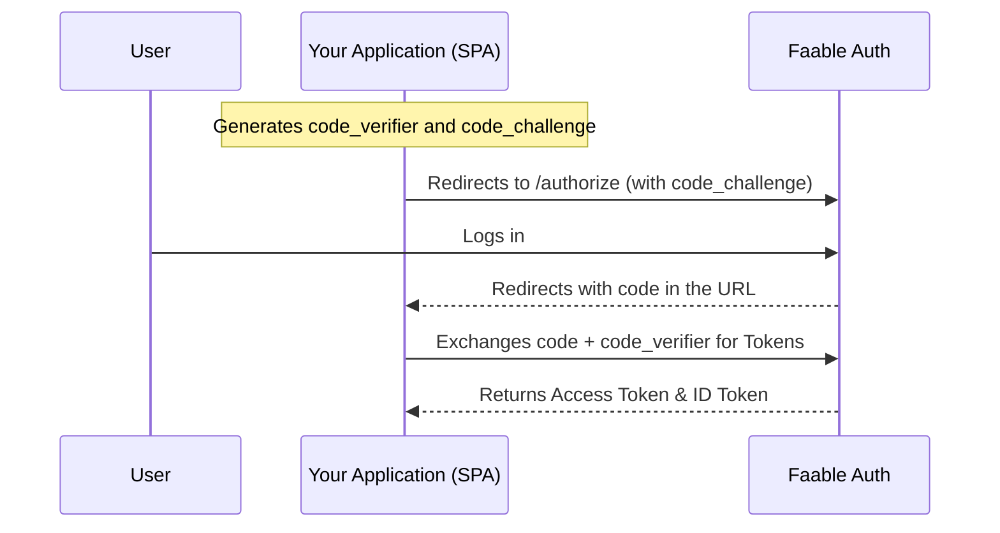

# OAuth 2.0: Authorization Code Flow with PKCE

The **OAuth 2.0 Authorization Code Flow with PKCE** (Proof Key for Code Exchange) is the security standard for applications that cannot securely store secrets, such as Single Page Applications (SPA) or native mobile apps.

This flow adds an extra layer of security through a cryptographic "challenge" that ensures the authorization code can only be exchanged for tokens by the same client that initiated the request.

---

## 📸 Flow Overview



---

## 🛠️ Step-by-Step

### Step 1: Redirect to `/authorize` endpoint

To start the OAuth 2.0 authentication flow, you must redirect the user to your Faable Auth domain. Your application needs to generate a random `code_verifier` and encode it as a challenge: `base64UrlEncode(sha256(code_verifier))`.

> [!TIP]
> If you are using our SDK `@faable/auth-js`, this entire PKCE cryptographic process happens automatically and transparently.

### Step 2: User Authentication

The user will see the Faable login screen and authenticate using their default connection (Email/Password, Google, GitHub, etc.).

### Step 3: Callback and Code Reception

After a successful login, Faable will redirect back to your application with a `code` parameter in the URL:

`https://your-app.com/callback?code=123456...`

### Step 4: Token Exchange

Your application takes that code and sends it back to Faable along with the original `code_verifier` to obtain the **Access Token**.

---

## 🚀 Quick Implementation with Faable SDK

You don't need to worry about the technical details of PKCE; our SDK manages the entire flow for you:

```ts
import { createClient } from "@faable/auth-js";

const auth = createClient({
  domain: "your-domain.auth.faable.link",
  clientId: "<your_client_id>",
});

// Starts the process: Generates the challenge and redirects
await auth.signInWithOauthConnection({
  redirectTo: "https://your-app.com/callback",
});
```

> [!IMPORTANT]
> Ensure that the `redirectTo` URL is configured in the **Allowed Callback URLs** whitelist in the Faable dashboard.

---

## 🔗 Further Reading

- **[@faable/auth-js](https://www.npmjs.com/package/@faable/auth-js)**: Our official JavaScript/TypeScript SDK for seamless authentication.
- **[RFC 7636 - Proof Key for Code Exchange (PKCE)](https://tools.ietf.org/html/rfc7636)**: The official standard for PKCE in OAuth 2.0.
- **[OAuth 2.0 Authorization Code Grant](https://oauth.net/2/grant-types/authorization-code/)**: General information about the Authorization Code flow.
