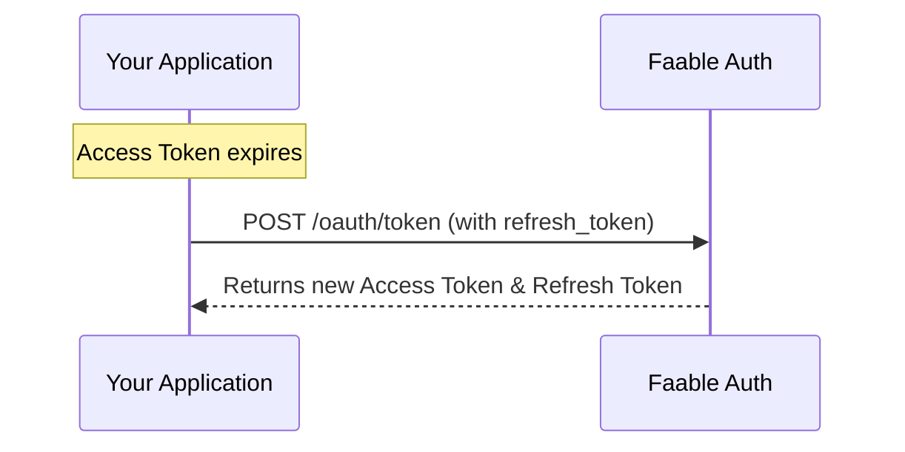

# OAuth 2.0: Refresh Token Flow 🔄

The **Refresh Token Flow** allows an application to obtain a new Access Token without requiring the user to log in again. This is essential for maintaining a seamless user experience, as Access Tokens are typically short-lived for security reasons.

---

## 📸 Flow Overview



---

## 🛠️ Automatic Management with @faable/auth-js

If you are using our official SDK, the Refresh Token flow is **managed automatically** for you.

When the library is initialized via `createClient`, it automatically checks if the current session's Access Token has expired. If it has, the SDK will use the stored Refresh Token to obtain a new one transparently.

```ts
import { createClient } from "@faable/auth-js";

// On initialization, the SDK checks and refreshes the session if needed
const auth = createClient({
  domain: "your-domain.auth.faable.link",
  clientId: "<your_client_id>",
});
```

---

## 🚀 Manual Refresh

In some cases, you might want to force a session refresh manually (for example, to ensure you have a fresh token before a critical API call). You can do this using the `refreshSession` method:

```ts
// Manually refresh the current session
const session = await auth.refreshSession();

console.log("New Access Token:", session.access_token);
```

---

## 🌐 API Reference

If you are implementing this flow manually, you must make a request to the token endpoint:

- **Endpoint:** `https://your-domain.auth.faable.link/oauth/token`
- **Method:** `POST`
- **Payload:**
  ```json
  {
    "grant_type": "refresh_token",
    "client_id": "YOUR_CLIENT_ID",
    "refresh_token": "YOUR_REFRESH_TOKEN"
  }
  ```

---

## 🔗 Related Sections

- **[Authorization Code Flow](authorization-code.md)**: The primary flow where Refresh Tokens are initially obtained.
- **[Clients](../clients.md)**: Configuration details for your application.
- **[RFC 6749 - Refresh Token Grant](https://datatracker.ietf.org/doc/html/rfc6749#section-6)**: Official standard for token renewal.
