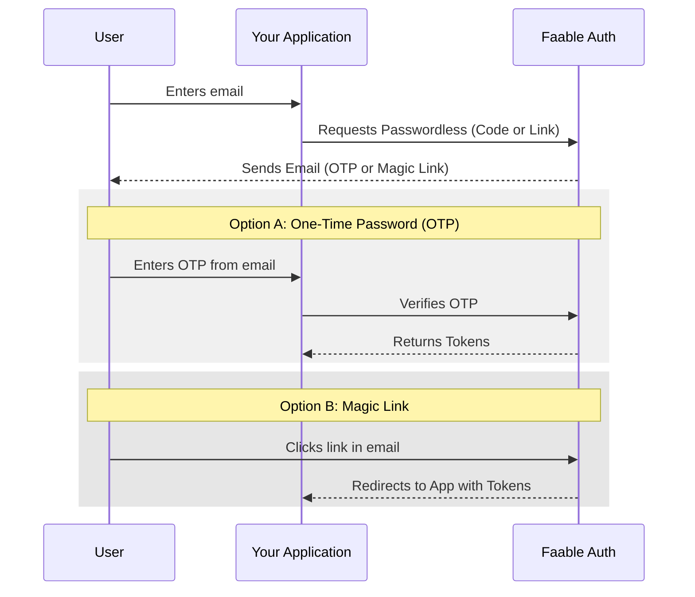

# Passwordless Authentication 📧

Passwordless authentication allows users to log in without needing to remember or enter a password. Instead, they receive a unique, one-time-use code (OTP) or a magic link via email.

Faable Auth provides a simple and secure way to implement this flow using our SDK or API.

> [!IMPORTANT]
> **Free Tier Limitation**: If you are on the **Community (Free)** plan, Passwordless authentication is limited to a total of **100 emails** (absolute lifetime limit). For unlimited passwordless sessions, consider upgrading to the **Professional** plan.

---

## 📸 Flow Overview



---

## 🛠️ Implementation with @faable/auth-js

The easiest way to implement passwordless login is by using our official JavaScript SDK.

### Step 1: Request the Passwordless session

You can choose between receiving a 6-digit code (`code`) or a magic link (`link`). This call triggers a request to the `/passwordless/start` endpoint of the API.

```ts
import { createClient } from "@faable/auth-js";

const faableauth = createClient({
  domain: "your-domain.auth.faable.link",
  clientId: "<your_client_id>",
});

// To request a numeric code (OTP)
await faableauth.signInWithPasswordless({
  email: "user@example.com",
  type: "code",
});

// OR, to request a magic link
await faableauth.signInWithPasswordless({
  email: "user@example.com",
  type: "link",
  redirect_to: "https://your-app.com/dashboard",
});
```

### Step 2: Verify the session

#### Using OTP (One-Time Password)

If the user requested a `code`, they will receive it in their inbox. You should provide a form for them to enter it and then call the following function to complete the login:

```ts
await faableauth.signInWithOtp({
  username: "user@example.com",
  otp: "123456", // The code from the email
});
```

#### Using Magic Link

If the user requested a `link`, the email will contain a link that directs to:
`https://your-domain.auth.faable.link/passwordless/verify_redirect`

If the verification is successful, Faable will automatically redirect the user to the URL specified in the `redirect_to` parameter during the `signInWithPasswordless` initial call.

---

## 🌐 API Reference

If you are not using our SDK, you can interact directly with our API endpoints. Some of the key endpoints involved are:

- `POST /passwordless/start`: Initiates the passwordless process.
- `GET /passwordless/verify_redirect`: Verifies a magic link and redirects the user.

---

## 🔗 Related Sections

- **[Clients](clients.md)**: Configure your application settings.
- **[Connections](connections.md)**: Manage your authentication providers.
- **[Social Login](social/google.md)**: Enable login with Google, Facebook, or Apple.
