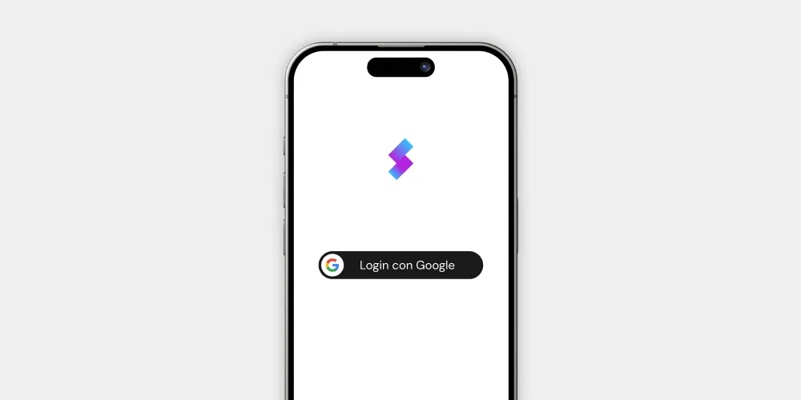
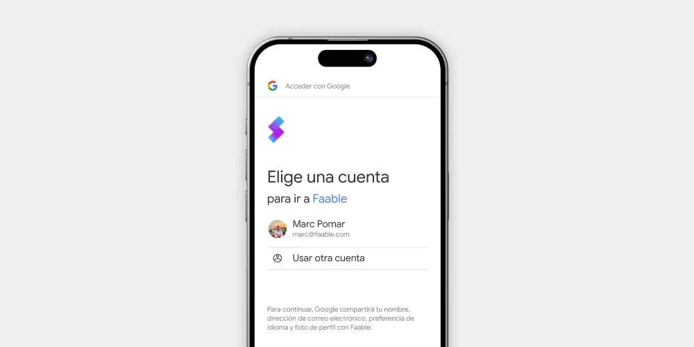

# Quickstart Expo and React Native: Google Social Login

In this guide we are going to implement the Faable Auth authentication service in React Native. The Identity Provider enables us to log in using Google, Facebook/Meta, Github, Shopify, Slack, among others, with a single configuration.

> ⚠️ Before starting:
>
> - Make sure you have the simulator installed according to the platform you are developing on, ios or Android.
> - Use your favorite code editor, in this case we will use VSCode.



## 🚀 Start

Open a new terminal to create a new project.

```bash
npx create-expo-app --template
```

Complete the installation questions.

1. Choose “Blank (TypeScript)”
2. Name your app
3. Wait for npm to install packages

```js
$ npx create-expo-app --template
Need to install the following packages:
create-expo-app@2.3.1
Ok to proceed? (y) y
✔ Choose a template: › Blank (TypeScript)
✔ What is your app named? … faable-login-expo
✔ Downloaded and extracted project files.

> npm install


added 1243 packages, and audited 1244 packages in 30s

✅ Your project is ready!

To run your project, navigate to the directory and run one of the following npm commands.

- cd faable-login-expo
- npm run android
- npm run ios
- npm run web
```

Once the installation is complete, we run the project to check that everything is working correctly.

```bash
npm run ios
```

We will end up with this folder structure.

```txt
📁faable-login-expo
└── .gitignore
└── app.json
└── App.tsx
└── 📁assets
└── adaptive-icon.png
└── favicon.png
└── icon.png
└── splash.png
└── babel.config.js
└── package-lock.json
└── package.json
└── tsconfig.json
```

## 🧩 Login Button

We create a new file where we put the component, we call it `LoginButton.tsx` here's the code for it.

```tsx
export const LoginButton = () => {
  return (
    <TouchableOpacity onPress={() => null}>
      <Text>Login</Text>
    </TouchableOpacity>
  );
};
```

Modify the `App.tsx` file to add our `<LoginButton/>` component for the user to log in.

```tsx
export default function App() {
  return (
    <SafeAreaView style={styles.container}>
      <LoginButton />
      <StatusBar style="dark" />
    </SafeAreaView>
  );
}
```

## ⚙️ Setup credentials



Create an auth folder and inside it create a `faableauth.ts` file and write all the necessary configuration.

Install **Faable Auth** required packages.

```bash
npm i @faable/auth-js @faable/auth-helpers-react expo-auth-session react-native-url-polyfill @react-native-async-storage/async-storage
```

Start writing code inside `faableauth.ts` file as required by expo to properly configure user session handling with oauth2 protocol.

```tsx
import "react-native-url-polyfill/auto";
import AsyncStorage from "@react-native-async-storage/async-storage";
import { createClient } from "@faable/auth-js";
import { makeRedirectUri } from "expo-auth-session";
import _ as WebBrowser from "expo-web-browser";
import _ as QueryParams from "expo-auth-session/build/QueryParams";


WebBrowser.maybeCompleteAuthSession(); // Required for web only
const redirectTo = makeRedirectUri(); // Redirection URI
```

> ⚠️ WARNING: importing the `react-native-url-polyfill/auto` library is required for `@faable/auth-js` to work properly.

create an instance of the client that will be shared across the entire application and place the configuration credentials for Faable Auth.

```tsx
import "react-native-url-polyfill/auto";
import AsyncStorage from "@react-native-async-storage/async-storage";
import { createClient } from "@faable/auth-js";

const faableAuthUrl = "https://<account_id>.auth.faable.link";
const clientId = "<xxxxxxxx-xxxx-xxxx-xxxx-xxxxxxxxxxxx>";

export const faableAuth = createClient({
  domain: faableAuthUrl,
  clientId,
  storage: AsyncStorage,
});
```

> ✅ Use the credentials you'll find on the [Faable Dashboard](https://dashboard.faable.com). Faable Auth is in beta so you'll need to request access by joining our [Discord channel](https://discord.gg/98JtRzYp).

```js
const createSessionFromUrl = async (url: string) => {
  const { params, errorCode } = QueryParams.getQueryParams(url);

  if (errorCode) throw new Error(errorCode);

  const { access_token, refresh_token } = params;

  if (!access_token) return;

  const { data, error } = await faableAuth.setSession({
    access_token,
    refresh_token,
  });

  if (error) throw error;

  return data.session;
};

// Oauth2 Login with FaableAuth
const login = async () => {
  try {
    const { data, error } = await faableAuth.signInWithOauthConnection({
      redirectTo,
      skipBrowserRedirect: true,
      connection: "connection_xxxxxxxxxxxxxxxxxxxxxx",
      queryParams: {
        prompt: "login",
      },
    });

    if (error) throw error;

    const res = await WebBrowser.openAuthSessionAsync(
      data?.url ?? "",
      redirectTo
    );

    if (res.type === "success") {
      const { url } = res;
      await createSessionFromUrl(url);
    }
  } catch (e) {
    console.error(e);
  }
};

// Clear session
const logout = async () => faableAuth.signOut();
```

> ⚠️ **IMPORTANT**: You must define which social connection you are going to use to log in. You will find the connection IDs in the dashboard. The connection IDs have this format `connection_xxxxxxxxxxxxxxxxxxxxxx`

We define a global context for the entire application in the main project file `App.tsx`. Configure the context by passing as a prop the instance of faableauth that we have previously configured.

```tsx
export default function App() {
  return (
    <SessionContextProvider faableauthClient={faableauth}>
      <SafeAreaView style={styles.container}>
        <LoginButton />
        <StatusBar style="light" />
      </SafeAreaView>
    </SessionContextProvider>
  );
}
```

## 👤 User Profile


Return to the `LoginButton.tsx` file to place the needed logic that allows us to display the user's information when the user has completed the login flow. To do this, we will use the `useSession()` hook provided with our helper library `@faable/auth-helpers-react` that allows us to **access the session and user data**.

```tsx
import { Image } from "expo-image";
import { StyleSheet, Text, TouchableOpacity, View } from "react-native";
import { login, logout } from "../../lib/auth/faableauth";
import { useSession } from "@faable/auth-helpers-react";

export const LoginButton = () => {
  const session = useSession();

  return (
    <>
      {!session && (
        <TouchableOpacity onPress={() => login()} style={styles.login_button}>
          <Text style={styles.text}>Login</Text>
        </TouchableOpacity>
      )}
      {session && (
        <View style={styles.container}>
          <View style={styles.profile_card}>
            <Image
              source={session.user.picture}
              contentFit="cover"
              style={styles.profile_image}
            />
            <Text style={styles.text_user_name}>{session.user.name}</Text>
          </View>
          <TouchableOpacity
            onPress={() => logout()}
            style={styles.logout_button}
          >
            <Text style={styles.text}>Logout</Text>
          </TouchableOpacity>
        </View>
      )}
    </>
  );
};
```

**Links:**

Here's the code repository with al, so you can clone it.

- [React-Native-Expo-FaableAuth Example Code](https://github.com/faablecloud/faableauth-examples/tree/main/react-native-expo)
