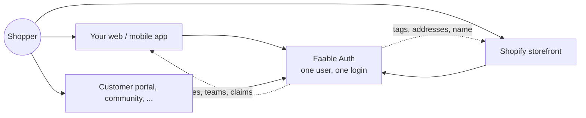
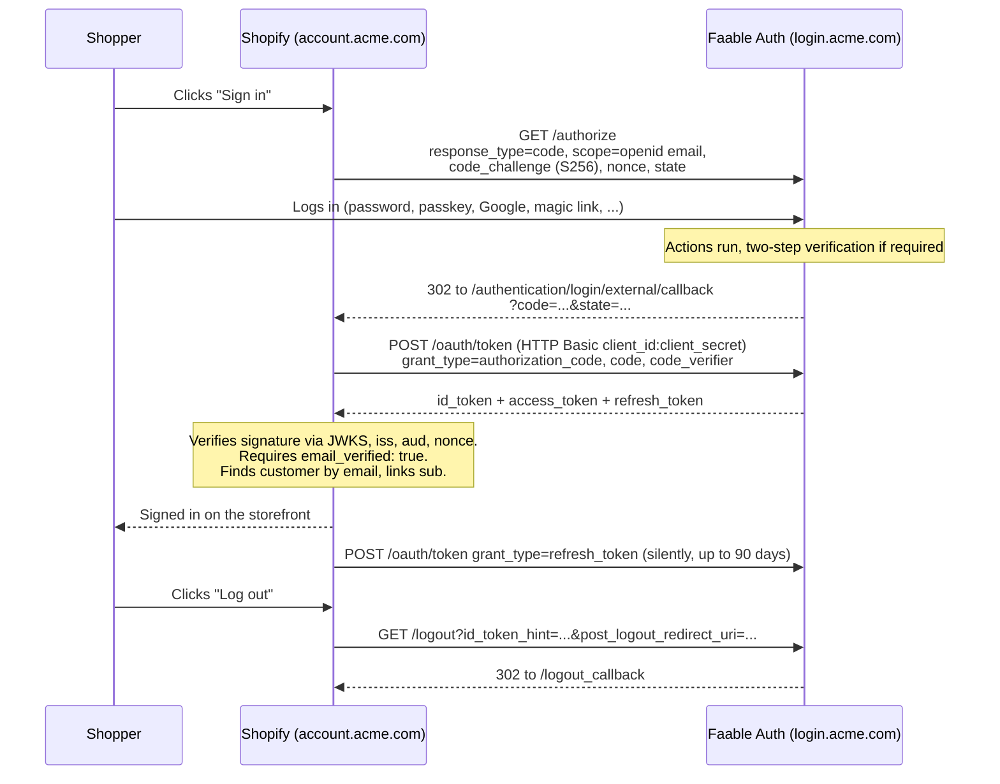

# Shopify Plus customer accounts

Shopify Plus lets a store replace the built-in customer login with **your own OpenID Connect identity provider**. Point it at Faable Auth and your shoppers sign in to the storefront with the same account they use in the rest of your product — one identity, one password reset, one audit log, and the same social logins, passkeys and two-step verification you already offer.

Faable Auth satisfies every requirement Shopify publishes for a third-party provider: authorization code flow, PKCE (S256), discovery, JWKS, RS256 signing, refresh tokens and RP-Initiated Logout. The contract is pinned by end-to-end tests in the server, so a release that would break the storefront login does not ship.

## Why one account for your product and your store

Out of the box, a Shopify store has its own customer list, its own login and its own password resets. If you also run an app, a member area or a customer portal, your customers end up with **two accounts that do not know about each other**: two emails to remember, two "forgot password" flows, and no way for your product to know what someone bought or for the store to know who is a member.

Connecting Shopify to Faable Auth collapses that into one identity:



| Without the integration                                        | With Faable Auth as the store's identity provider                                                          |
| -------------------------------------------------------------- | ---------------------------------------------------------------------------------------------------------- |
| Separate signup and password for the store                     | The store reuses the account the shopper already has; a new shopper on the store gets an app account too   |
| Store login is email + password only                           | Google, GitHub, Microsoft, magic links, passkeys and two-step verification, the same as in your app        |
| Membership status lives in your database, invisible to Shopify | An Action turns it into a Shopify customer tag on every sign-in; Shopify pricing and segments react to it  |
| Blocking a fraudulent customer means two admin panels          | Suspending the user in Faable Auth ends the store session at the next token refresh                        |
| Support reconstructs "who signed in where" from two systems    | One audit log with every login, denial and token issued for the store                                      |
| Customer identity belongs to the store                         | Identity belongs to you; adding a second store, a mobile app or a new channel does not create new accounts |

### Real-world scenarios

**A fitness app that also sells equipment.** Members subscribe inside the app and buy mats, bands and apparel in a Shopify store. With one account, a member who taps "Shop" in the app is already signed in on the storefront, and the loyalty tier stored in the app becomes a `loyalty-gold` tag in Shopify that unlocks member pricing through Shopify's own discount rules. A visitor who first buys a mat on the store and later downloads the app signs in with the same email and password, or the same passkey, without a second signup.

**A B2B distributor with a customer portal and a wholesale store.** Buyers use the portal for invoices and order history, and a Shopify Plus B2B storefront for ordering. Faable Auth is the one login for both. [Team invitations](../team-invitations.md) bring a new purchasing manager into a customer's team; an Action reads the team's terms and emits a `wholesale` tag and the company's shipping addresses, so the buyer lands in Shopify with the right catalog and addresses already in place. When a customer stops paying, suspending the account in Faable Auth blocks the portal immediately and the store at the next refresh.

**A media brand with a community and a merch store.** The community runs on [passwordless](../passwordless.mdx) login: a magic link, no password ever. Because every passwordless user has a verified email by construction, the same accounts satisfy Shopify's `email_verified` requirement with nothing else to configure. Newsletter readers buy merch with the link they already use, and the `signup-web` tag from the Action tells the store which customers came from the community.

**A hardware company with a device app and a spare-parts store.** Owners set up their device in a mobile app protected with passkeys. Buying a replacement filter in the Shopify store uses the same passkey: Face ID on the phone, no password, and the shipping address from the app profile arrives in Shopify through the standard `address` claim, so checkout is pre-filled.

**A brand with several stores.** An EU store and a US store are two Shopify stores, each connected as its own client in the same Faable Auth tenant. A customer who moves between them is one person with one login and one order history on your side. Shopify still keeps a customer record per store, but neither store owns the identity; you do.

### What the shopper notices

Almost nothing, which is the point. The "Sign in" button on the store sends them to your login page on your domain, with your branding and the sign-in methods your app already offers. After signing in they are back on the store, signed in, for up to 90 days. If they signed in to your app through Faable Auth recently in the same browser, the store sign-in is a single redirect with no form at all.

## How it works

Shopify is a regular OpenID Connect Relying Party. It reads your discovery document once, sends shoppers to your `/authorize` endpoint, exchanges the code for tokens, and reads `sub` and `email` from the ID token to find or create the customer.



Three things in that diagram cause nearly every support ticket, so they get their own sections below: the **issuer must match byte for byte**, the ID token must carry **`email_verified: true`**, and the **post-logout URL must be registered** on the Faable side.

## Before you start

- **A Shopify Plus plan.** Connecting your own identity provider is a Plus-only feature. On any other plan the option does not exist in the Shopify admin.
- **A Faable Auth tenant on HTTPS** — your [custom domain](../custom-domain.md) or the `*.auth.faable.link` one. Decide the hostname now; changing it later means re-doing the Shopify side.
- **At least one connection** your shoppers will use to sign in — see [Connections](../connections.md). Read [Email verification is required](#email-verification-is-required) before choosing.

### The example used on this page

| Thing                              | Value in the examples                     |
| ---------------------------------- | ----------------------------------------- |
| Store                              | Acme Outdoor, `acme.com`                  |
| Shopify customer accounts domain   | `account.acme.com`                        |
| Faable Auth tenant (custom domain) | `login.acme.com`                          |
| Faable Auth client                 | "Shopify storefront", `client_id=cl_7f3…` |

Replace `login.acme.com` with your tenant hostname and `account.acme.com` with the customer accounts domain Shopify shows you.

## Step 1 — Open the connection form in Shopify

1. In the Shopify admin go to **Settings → Customer accounts**.
2. In the **Identity provider** section click **Manage**, then **Connect to provider**.
3. Enter a name shoppers will recognise in **Identity provider name** (for example "Acme account").
4. Keep this page open. The **Setup configurations** section shows the two URLs Shopify wants you to register on the provider side:

| Shopify calls it | Looks like                                                        | Goes into Faable Auth as |
| ---------------- | ----------------------------------------------------------------- | ------------------------ |
| **Callback URL** | `https://account.acme.com/authentication/login/external/callback` | Callback URLs            |
| **Logout URL**   | `https://account.acme.com/logout_callback`                        | Logout URLs              |

Copy them exactly as displayed. Shopify may list more than one logout URL; register all of them.

## Step 2 — Create the client in Faable Auth

1. In the [Faable Dashboard](https://dashboard.faable.com) open your Auth tenant → **Clients** → **Create**. Name it "Shopify storefront". Shopify is a confidential client (it keeps the secret on its servers), so a regular web application is the right kind.
2. Paste Shopify's **Callback URL** into **Callback URLs**.
3. Paste Shopify's **Logout URL(s)** into **Logout URLs**.
4. Leave **Allowed Web Origins** empty. Shopify never calls the token endpoint from a browser.
5. Note the **Client ID** and **Client Secret**. You paste them into Shopify in the next step.

If you prefer the [Management API](../academy/05-server-and-management-api.md) (the SDK call maps one-to-one to `POST /client`):

```ts
import { FaableAuthApi, authClientCredentials } from '@faable/auth-sdk'

const api = FaableAuthApi.create({
  domain: 'login.acme.com',
  authStrategy: authClientCredentials,
  auth: {
    client_id: process.env.FAABLEAUTH_CLIENT_ID!,
    client_secret: process.env.FAABLEAUTH_CLIENT_SECRET!
  }
})

const client = await api.clientCreate({
  name: 'Shopify storefront',
  callbacks: [
    'https://account.acme.com/authentication/login/external/callback'
  ],
  logout_urls: ['https://account.acme.com/logout_callback'],
  web_origins: []
})
// client.client_id, client.client_secret
```

### Refresh token lifetime

Shopify keeps a shopper signed in for **up to 90 days** by refreshing tokens in the background. Faable Auth always returns a refresh token on the authorization code exchange and **rotates** it on every refresh, so the session lives as long as the shopper comes back before the current refresh token expires.

The default lifetime is **30 days** of inactivity. To let Shopify use the full 90 days, open the client → **Refresh token** and set the lifetime to `7776000` seconds. You do not need to request `offline_access`; adding it to Shopify's scopes is harmless.

## Step 3 — Paste the provider details into Shopify

Back in the Shopify form, fill the **Application info** section:

| Shopify field         | Value                                                                                                                                                       |
| --------------------- | ----------------------------------------------------------------------------------------------------------------------------------------------------------- |
| **Discovery URL**     | `https://login.acme.com/.well-known/openid-configuration`                                                                                                   |
| **Client ID**         | The client's **Client ID**                                                                                                                                  |
| **Client secret**     | The client's **Client Secret**                                                                                                                              |
| **Additional scopes** | Leave empty for login only. Add `profile phone address` to also sync names, phone and address — see [Sync customer data](#sync-customer-data-into-shopify). |

Shopify always requests `openid email` on its own. Its default token endpoint authentication method, `client_secret_basic` (HTTP Basic), is what Faable Auth expects, so there is nothing to switch.

If the form asks for endpoints individually instead of reading discovery:

| Endpoint      | URL                                            |
| ------------- | ---------------------------------------------- |
| Authorization | `https://login.acme.com/authorize`             |
| Token         | `https://login.acme.com/oauth/token`           |
| UserInfo      | `https://login.acme.com/userinfo`              |
| JWKS          | `https://login.acme.com/.well-known/jwks.json` |
| Logout        | `https://login.acme.com/logout`                |

> [!IMPORTANT]
> **Use the exact same hostname everywhere, with no trailing slash.** Faable Auth derives the `iss` claim from the host that served the request. A discovery document fetched from `login.acme.com` advertises `"issuer": "https://login.acme.com"` and every endpoint under it, and the ID tokens carry that same issuer. If Shopify reads discovery from one hostname while shoppers are sent to another (`acme.auth.faable.link` vs `login.acme.com`, `www.`, `http://`), Shopify rejects the ID token because the issuer does not match.

You can check what Shopify will see:

```bash
curl -s https://login.acme.com/.well-known/openid-configuration | jq '{issuer, authorization_endpoint, token_endpoint, jwks_uri, end_session_endpoint, response_types_supported, grant_types_supported, code_challenge_methods_supported, token_endpoint_auth_methods_supported}'
```

```json
{
  "issuer": "https://login.acme.com",
  "authorization_endpoint": "https://login.acme.com/authorize",
  "token_endpoint": "https://login.acme.com/oauth/token",
  "jwks_uri": "https://login.acme.com/.well-known/jwks.json",
  "end_session_endpoint": "https://login.acme.com/logout",
  "response_types_supported": ["code"],
  "grant_types_supported": ["authorization_code", "refresh_token", "..."],
  "code_challenge_methods_supported": ["S256"],
  "token_endpoint_auth_methods_supported": ["client_secret_basic", "none"]
}
```

## Step 4 — Test and activate

1. Click **Save**.
2. Click **Test connection**. Shopify redirects you to your Faable Auth login page; sign in with a user whose email is verified.
3. Back in Shopify, click **Activate**. An **Active** badge appears next to the provider name.

From this moment the default Shopify login is gone for this store. Shoppers who were signed in are asked to sign in again through Faable Auth. Shopify matches them by email: an ID token whose `email` matches an existing customer signs into that customer and links its `sub`; an unknown email creates a new customer. The `sub` is shown as the subject ID on the customer profile, and an admin can **Unlink** it if a profile was ever linked to the wrong identity.

## What the ID token looks like

This is what Faable Auth returns to Shopify for the example shopper, with `openid email profile` requested and no Actions involved:

```json
{
  "iss": "https://login.acme.com",
  "sub": "user_9c2d1e6a4f8b",
  "aud": "cl_7f3a9d2e",
  "iat": 1757152000,
  "exp": 1757238400,
  "nonce": "n-0S6_WzA2Mj",
  "auth_time": 1757151998,
  "amr": ["pwd", "otp"],
  "acr": "urn:faable:loa:2",
  "sid": "sid_4b1e…",
  "email": "jane@acme.com",
  "email_verified": true,
  "name": "Jane Doe",
  "given_name": "Jane",
  "family_name": "Doe",
  "picture": "https://…",
  "updated_at": 1757000000
}
```

| Claim            | Shopify uses it for                                                                       |
| ---------------- | ----------------------------------------------------------------------------------------- |
| `iss`, `aud`     | Must equal the issuer from discovery and your Client ID. Otherwise the token is rejected. |
| `nonce`          | Replay protection. Echoed from the `/authorize` request.                                  |
| `sub`            | Stable link to the Shopify customer.                                                      |
| `email`          | Finds or creates the customer.                                                            |
| `email_verified` | **Must be `true`** or Shopify refuses the sign-in.                                        |
| `given_name` …   | Optional profile sync, see below.                                                         |

## Email verification is required

This is the part worth reading twice. **Shopify only provisions a customer account when the ID token carries `email_verified: true`.** A user whose email Faable Auth has not verified can authenticate perfectly and still be turned away by Shopify with a generic error.

Faable Auth reports `email_verified` honestly — it never asserts a verification that did not happen — so which connection your users sign in with decides whether they can shop:

| Connection                                             | `email_verified`                                                   |
| ------------------------------------------------------ | ------------------------------------------------------------------ |
| **Passwordless** (magic link or code)                  | ✅ always — proving control of the inbox _is_ the login            |
| Email + password (database)                            | ❌ **not at signup** — until the user clicks the verification link |
| Google, GitHub                                         | ✅ when the provider attests it                                    |
| **Microsoft (Entra ID)**                               | ❌ never — see below                                               |
| After a verification link, invitation, or email change | ✅                                                                 |

**Recommendation: use a [passwordless](../passwordless.mdx) connection for stores.** Every user is verified by construction and there is nothing else to configure.

If you use **email + password**, turn on **Auto-send email verification** for the tenant (Dashboard → Auth → Settings → **Notifications**) so new users receive the verification link at signup. Until they click it, their first Shopify sign-in fails.

**Microsoft never reports a verified email**, and that is deliberate. Entra sources the email from the directory's `mail` attribute, which a tenant administrator can point at a domain they do not own — so treating it as verified would let them claim someone else's customer account. Microsoft users must complete Faable Auth's own email verification before they can use the storefront.

To check a specific user, read `email_verified` on `GET /user/:id`, or open the user in the dashboard. Do **not** set `email_verified: true` by hand to "fix" a login: you would be telling Shopify that a verification happened when it did not.

### Optional: fail early with a clear message

Shopify's error page for a rejected token is generic. If you want unverified users to learn what to do while they are still on your login page, add an [Action](../extensibility/actions.md) that denies the login for the Shopify client only:

```js
// Action: "Shopify requires a verified email"
const SHOPIFY_CLIENT_ID = 'cl_7f3a9d2e'

exports.onExecutePostLogin = async (event, api) => {
  if (event.client.client_id !== SHOPIFY_CLIENT_ID) return
  if (event.user.email_verified) return

  api.access.deny(
    'Please verify your email address before signing in to the store. Check your inbox for the verification link.'
  )
}
```

The reason is recorded in the tenant [logs](../logs.md) next to the user, which is where support will look first.

## Sync customer data into Shopify

Shopify can copy claims from the ID token into the customer profile on every sign-in. Enable it in **Settings → Customer accounts → Third-party identity provider**: turn on **Sync customer data**, choose the **overwrite rules** (keep existing values, or replace them with what the token says), and request the extra scopes in **Additional scopes**.

| Shopify field        | Claim                            | Scope to add | Faable Auth user field                                                       |
| -------------------- | -------------------------------- | ------------ | ---------------------------------------------------------------------------- |
| First name           | `given_name`                     | `profile`    | `given_name`                                                                 |
| Last name            | `family_name`                    | `profile`    | `family_name`                                                                |
| Phone                | `phone_number` (E.164)           | `phone`      | `phone` — store it as `+34600111222`                                         |
| Default address      | `address` (OIDC object)          | `address`    | `address.street_address`, `.locality`, `.region`, `.postal_code`, `.country` |
| Tags                 | `urn:shopify:customer:tags`      | —            | Set from an Action, see below                                                |
| Additional addresses | `urn:shopify:customer:addresses` | —            | Set from an Action, see below                                                |

Faable Auth fills the standard claims from the user profile, filtered by scope exactly like `/userinfo`. Keep the user record in shape with the management API:

```http
POST /user/user_9c2d1e6a4f8b
Authorization: Bearer <management_access_token>
Content-Type: application/json

{
  "given_name": "Jane",
  "family_name": "Doe",
  "phone": "+34600111222",
  "address": {
    "street_address": "Calle Mayor 1",
    "locality": "Madrid",
    "region": "MD",
    "postal_code": "28013",
    "country": "ES"
  }
}
```

Shopify maps `region` to `province_code` (ISO 3166-2) and `country` to `country_code` (ISO 3166-1 alpha-2). It validates everything before writing.

> [!WARNING]
> **Claim import is all-or-nothing.** A phone that is not valid E.164, a country that is not a two-letter code, or HTML in any value makes Shopify skip the whole import for that sign-in (it retries next time and logs a timeline event on the customer). Nothing breaks the login itself, but the profile silently stays stale.

### Tags and extra addresses with an Action

The two `urn:shopify:customer:*` claims are not OIDC standard claims, so they come from an Action that reads your own data and sets them on the ID token. This example keeps them in the user's `app_metadata`, which only your backend can write:

```js
// Action: "Shopify customer enrichment"
const SHOPIFY_CLIENT_ID = 'cl_7f3a9d2e'

exports.onExecutePostLogin = async (event, api) => {
  // Only the storefront client needs these claims.
  if (event.client.client_id !== SHOPIFY_CLIENT_ID) return

  const meta = event.user.app_metadata || {}

  // Comma-separated string. Replaces ALL tags on the customer when
  // Shopify's overwrite rule is "replace".
  const tags = []
  if (meta.loyalty_tier) tags.push(`loyalty-${meta.loyalty_tier}`)
  if (meta.wholesale) tags.push('wholesale')
  if (event.stats && event.stats.is_new_user) tags.push('signup-web')
  if (tags.length) {
    api.idToken.setCustomClaim('urn:shopify:customer:tags', tags.join(', '))
  }

  // Array in Shopify's Admin API address format. Treated as a group: an
  // empty array clears every address, so only send it when you mean it.
  if (
    Array.isArray(meta.shipping_addresses) &&
    meta.shipping_addresses.length
  ) {
    api.idToken.setCustomClaim(
      'urn:shopify:customer:addresses',
      meta.shipping_addresses.slice(0, 5).map((a, i) => ({
        first_name: event.user.given_name,
        last_name: event.user.family_name,
        address1: a.line1,
        address2: a.line2,
        city: a.city,
        province_code: a.region,
        zip: a.postal_code,
        country_code: a.country,
        phone: a.phone,
        default: i === 0
      }))
    )
  }
}
```

The resulting ID token carries, next to the standard claims:

```json
{
  "urn:shopify:customer:tags": "loyalty-gold, wholesale",
  "urn:shopify:customer:addresses": [
    {
      "first_name": "Jane",
      "last_name": "Doe",
      "address1": "Calle Mayor 1",
      "city": "Madrid",
      "province_code": "MD",
      "zip": "28013",
      "country_code": "ES",
      "default": true
    }
  ]
}
```

Things to know about custom claims in Faable Auth:

- Claim names may contain letters, digits, `_ . : / -`, so the `urn:shopify:…` names are fine. An Action can never rewrite the user's identity: the real `email`, `email_verified`, `given_name` and other profile claims always win over a same-named custom claim, and setting a reserved name (`sub`, `aud`, `nonce`, `sid`, `acr`, …) throws and fails the login.
- Limits per token: **10 custom claims and 2 KB**. A long addresses array is the only realistic way to hit them, hence the `slice(0, 5)`.
- Claims set at login are frozen into the refresh token and re-emitted on every refresh. Shopify re-imports on **sign-in**, so a changed tag reaches the customer profile the next time the shopper signs in, not on a background refresh.
- A later `api.access.deny()` in the chain discards the claims together with the login.

## Signing out

Shopify implements **RP-Initiated Logout**. When a shopper logs out of the storefront, Shopify sends the browser to your `end_session_endpoint`:

```http
GET https://login.acme.com/logout
    ?id_token_hint=<the id_token>
    &post_logout_redirect_uri=https://account.acme.com/logout_callback
    &state=<opaque>
```

Faable Auth ends the session, then redirects to `post_logout_redirect_uri` with `state` echoed back. That URL must **exactly match** an entry in the client's **Logout URLs** — no prefix matching, no wildcards. If it does not, the shopper sees a `400` page from Faable Auth instead of the store. It is the single most common thing to forget, and it only shows up the first time a customer signs out.

Logging out of the store does not sign the shopper out of your other applications unless they share the Faable Auth session cookie on the same domain and you use [Front-Channel Logout](../oidc/logout.md) there. Shopify itself does not support back-channel or front-channel logout, so a session ended elsewhere is not pushed to the storefront; the storefront session simply ends when the refresh token expires, or at the next refresh if you [suspend the user](../suspend-users.md) in Faable Auth.

## Performance: the one-second rule

Shopify aborts the sign-in if your **token**, **discovery** or **userinfo** endpoint takes longer than **one second** to respond. Faable Auth answers these in tens of milliseconds, and your [Actions](../extensibility/actions.md) do not run on them: they run while the shopper is still on your login page, before the redirect back to Shopify. Long-running Actions make the login page slower, never the token exchange.

What can push you over the limit is something in front of Faable Auth: a custom domain routed through a slow proxy, a WAF challenge on `/oauth/token`, or a certificate problem. If sign-ins fail intermittently with a Shopify-side error and nothing shows in your tenant logs, time the endpoints from outside:

```bash
curl -o /dev/null -s -w '%{time_total}\n' https://login.acme.com/.well-known/openid-configuration
```

## Changing domains later

If you move the Shopify customer accounts domain, or move Faable Auth to a custom domain, do it in this order:

1. Add the **new** Callback URL and Logout URL to the Faable Auth client while keeping the old ones.
2. Change the domain in Shopify (for a Faable domain change: update the Discovery URL so the issuer changes too).
3. Test a sign-in and a sign-out.
4. Remove the old URLs.

Changing the Faable Auth hostname changes the `iss` of every new token. Shopify re-reads discovery, but sessions issued under the old issuer are invalid afterwards, so expect every shopper to sign in once more.

## Headless storefronts

If you run a headless storefront (Hydrogen or your own frontend using the Customer Account API), the identity provider connection still applies: Shopify's hosted `account.acme.com` login is what sends shoppers to Faable Auth. Buyers authenticated through your identity provider also need to be authenticated in checkout; follow Shopify's checkout authentication guidance for headless stores. Faable Auth needs no extra configuration for that.

## Troubleshooting

| Symptom                                                   | Cause and fix                                                                                                                                           |
| --------------------------------------------------------- | ------------------------------------------------------------------------------------------------------------------------------------------------------- |
| Shopify rejects the provider at setup                     | Discovery URL unreachable, or the issuer does not match byte for byte (trailing slash, `www.`, `http` vs `https`). Curl it as shown above.              |
| The connection option is missing in Shopify               | The store is not on Shopify Plus.                                                                                                                       |
| "Test connection" redirects but ends in an error          | The signed-in user has `email_verified: false`. Sign in with a verified user or a passwordless connection.                                              |
| A customer signs in but Shopify shows an error            | Same cause: `email_verified` is not `true` for that user. Check `GET /user/:id`.                                                                        |
| `invalid_client` at token exchange                        | Wrong Client Secret, or Client ID pasted with whitespace.                                                                                               |
| `invalid_grant` at token exchange                         | The code was already used or expired, or `redirect_uri` differs from the registered Callback URL. Usually a stale tab; retry.                           |
| Sign-out shows a `400` page                               | Shopify's `post_logout_redirect_uri` is not in the client's **Logout URLs** (exact match).                                                              |
| Shoppers are signed out after 30 days                     | Refresh token lifetime is the 30-day default. Raise it to `7776000` in the client's **Refresh token** settings.                                         |
| Names or phone do not appear on the customer              | `profile` / `phone` not in **Additional scopes**, **Sync customer data** off, or the import was skipped because one value failed validation.            |
| Tags or addresses do not appear                           | The Action is disabled, guards on the wrong `client_id`, or the addresses array exceeded the 2 KB claim budget. Check the `action.claims` rows in logs. |
| A customer is linked to the wrong account                 | Open the customer in Shopify admin and **Unlink** the provider ID; the next sign-in re-links by email.                                                  |
| Sign-in fails intermittently, nothing in Faable Auth logs | An endpoint exceeded Shopify's one-second timeout. Check what sits in front of your custom domain.                                                      |

## Limitations

- Shopify supports **RP-Initiated Logout** only. Back-channel and front-channel logout are not used, so a session ended elsewhere is not pushed to the storefront.
- Implicit and hybrid flows are unsupported on both sides. Authorization code only.
- Customers who sign in through an external identity provider **cannot change their email from the Shopify account page**. Email changes happen in Faable Auth (see [Change Email](../change-email.md)); a customer already linked by `sub` keeps their Shopify account.
- One Faable Auth client per store.

## Reference: Faable Auth endpoints Shopify uses

| Purpose       | URL                                                       |
| ------------- | --------------------------------------------------------- |
| Discovery     | `https://login.acme.com/.well-known/openid-configuration` |
| JWKS          | `https://login.acme.com/.well-known/jwks.json`            |
| Authorization | `https://login.acme.com/authorize`                        |
| Token         | `https://login.acme.com/oauth/token`                      |
| UserInfo      | `https://login.acme.com/userinfo`                         |
| Logout        | `https://login.acme.com/logout`                           |

Further reading: [Authorization Code Flow](../oauth-flows/authorization-code.md) · [Refresh Token](../oauth-flows/refresh-token.md) · [OpenID Connect](../oidc) · [Actions](../extensibility/actions.md) · [Custom Domain](../custom-domain.md).
