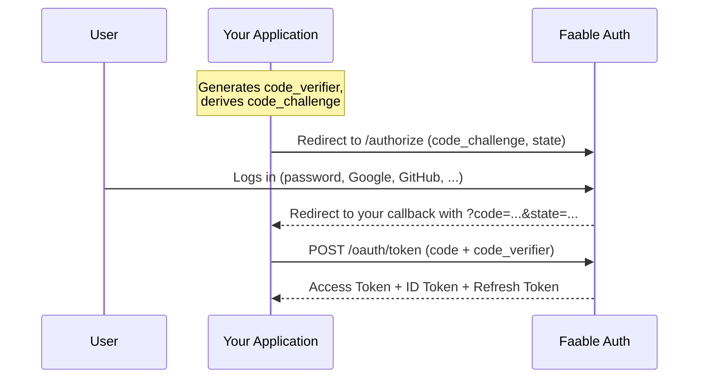

# Authorization Code Flow with PKCE 🔐

The **OAuth 2.0 Authorization Code flow with PKCE** (Proof Key for Code Exchange) is the standard way to **log users in**. The user authenticates on your Faable Auth domain, your app receives a one-time code, and exchanges it for tokens — an **access token** to call your APIs, an **ID token** with the user's identity, and a **refresh token** to keep the session alive.

PKCE adds a cryptographic proof that ties the code to the client that started the flow, so it's safe even for apps that **cannot keep a secret**:

- ✅ Single Page Applications (React, Vue, Angular)
- ✅ Native and mobile apps (iOS, Android, React Native)
- ✅ Server-side web apps (Next.js, Express)

For backend services calling APIs **without a user**, use the [Client Credentials flow](client-credentials.md) instead.

---

## 📸 How It Works



The `code` is single-use and short-lived. Even if it's intercepted, it's useless without the `code_verifier` — which never left your app.

---

## ✅ Prerequisites

From the [Faable Dashboard](https://dashboard.faable.com):

1. **Create a Client** for your application — this gives you the `client_id`. See [Clients](../clients.md).
2. **Add your callback URL** (e.g. `https://your-app.com/callback`) to the client's **Allowed Callback URLs**. Redirects to unlisted URLs are rejected.

---

## 🚀 Quick Start with `@faable/auth-js`

The fastest path: our SDK generates the PKCE verifier, handles the redirect, exchanges the code, stores the session, and auto-refreshes tokens.

```ts
import { createClient } from "@faable/auth-js";

const auth = createClient({
  domain: "your-domain.auth.faable.link",
  clientId: "YOUR_CLIENT_ID",
});

// 1. Start the login — generates PKCE values and redirects to Faable
await auth.signInWithOauthConnection({
  redirectTo: "https://your-app.com/callback",
});
```

On your callback page, complete the exchange and read the session:

```ts
// 2. On /callback — exchanges the code for tokens and stores the session
await auth.initialize();

// 3. Anywhere in your app
const { data } = await auth.getSession();
console.log(data.session?.user);
```

That's it — the SDK also refreshes the access token transparently when it expires, using the [Refresh Token flow](refresh-token.md).

> [!IMPORTANT]
> The `redirectTo` URL must be listed in the client's **Allowed Callback URLs** in the dashboard, or the request will be rejected.

---

## 🛠️ Step-by-Step over HTTP

Implementing it yourself, or curious what the SDK does under the hood? The whole flow is two requests.

### Step 1: Redirect the User to `/authorize`

Generate a random `code_verifier`, derive the challenge as `base64url(sha256(code_verifier))`, and redirect the browser to:

- **Endpoint:** <TennantDomain url="/authorize"/>
- **Method:** `GET` (browser redirect)

```
https://your-domain.auth.faable.link/authorize
  ?response_type=code
  &client_id=YOUR_CLIENT_ID
  &redirect_uri=https://your-app.com/callback
  &scope=openid profile email
  &state=RANDOM_OPAQUE_VALUE
  &code_challenge=BASE64URL_SHA256_OF_VERIFIER
  &code_challenge_method=S256
```

| Parameter               | Required    | Description                                                                                                 |
| :---------------------- | :---------- | :----------------------------------------------------------------------------------------------------------- |
| `response_type`         | Yes         | Must be `code`.                                                                                               |
| `client_id`             | Yes         | Your application's Client ID.                                                                                 |
| `redirect_uri`          | Yes         | Where to send the user after login. Must be in the client's **Allowed Callback URLs**.                        |
| `scope`                 | Recommended | Space-separated. Use `openid profile email` to get an ID token with the user's profile.                       |
| `state`                 | Recommended | Opaque random value echoed back on the callback. **Verify it matches** to prevent CSRF.                       |
| `code_challenge`        | Recommended | `base64url(sha256(code_verifier))`. Enables PKCE.                                                             |
| `code_challenge_method` | Recommended | Only `S256` is supported.                                                                                     |
| `audience`              | No          | Identifier of the [API](../apis.md) the access token should target (sets its `aud` claim).                    |
| `connection_id`         | No          | Which [connection](../connections.md) to use (e.g. a specific social provider). Defaults to the tenant's default connection. |
| `nonce`                 | No          | OIDC replay protection — echoed in the issued `id_token`.                                                     |
| `prompt`                | No          | Controls the login UI — see [Controlling the prompt](#controlling-the-prompt).                                |

### Step 2: The User Logs In

Faable shows your tenant's login screen and the user authenticates with any connection you've enabled — email/password, passwordless OTP, Google, GitHub, or a custom provider.

### Step 3: Receive the Code on Your Callback

On success, the browser lands back on your app:

```
https://your-app.com/callback?code=AUTHORIZATION_CODE&state=RANDOM_OPAQUE_VALUE
```

Verify that `state` matches the value you sent in Step 1. On failure (e.g. the user cancels, or `prompt=none` needed interaction), the redirect carries an error instead:

```
https://your-app.com/callback?error=access_denied&error_description=...&state=...
```

### Step 4: Exchange the Code for Tokens

From your app, `POST` the code to the token endpoint together with the original `code_verifier`:

- **Endpoint:** <TennantDomain url="/oauth/token"/>
- **Content-Type:** `application/x-www-form-urlencoded` or `application/json`

```bash
curl --request POST \
  --url 'https://your-domain.auth.faable.link/oauth/token' \
  --header 'content-type: application/x-www-form-urlencoded' \
  --data 'grant_type=authorization_code' \
  --data 'client_id=YOUR_CLIENT_ID' \
  --data 'code=AUTHORIZATION_CODE' \
  --data 'code_verifier=ORIGINAL_CODE_VERIFIER' \
  --data 'redirect_uri=https://your-app.com/callback'
```

### Response

```json
{
  "access_token": "eyJhbGciOiJSUzI1NiIs...",
  "id_token": "eyJhbGciOiJSUzI1NiIs...",
  "refresh_token": "v1.MRjD...",
  "token_type": "Bearer",
  "expires_in": 86400
}
```

| Field           | Description                                                                                                   |
| :-------------- | :------------------------------------------------------------------------------------------------------------ |
| `access_token`  | Signed JWT (RS256) for calling your APIs. Send it as `Authorization: Bearer <token>`.                          |
| `id_token`      | OIDC JWT with the user's identity claims (`sub`, `email`, `name`, ...).                                        |
| `refresh_token` | Use it to obtain new access tokens without re-authenticating — see [Refresh Token flow](refresh-token.md).     |
| `expires_in`    | Access token lifetime in **seconds**, controlled by the target API's `token_lifetime` (default: 86400 = 24 h). |

> [!NOTE]
> The authorization `code` is **single-use** — it is consumed and invalidated on the first exchange. A second exchange with the same code fails.

---

## 🎛️ Controlling the Prompt

The optional `prompt` parameter on `/authorize` controls whether the user sees the login UI. It accepts a space-separated list:

| Value            | Behavior                                                                                                                                    |
| :--------------- | :------------------------------------------------------------------------------------------------------------------------------------------ |
| `none`           | **SSO probe.** No UI is ever displayed; the request errors if interaction would be needed. Must be the only value. Useful for silent re-authentication from a SPA. |
| `login`          | Forces the user to re-authenticate, even with an active session.                                                                             |
| `consent`        | Forces the consent step before issuing tokens. Currently behaves like `login` (a dedicated consent screen is on the roadmap).                |
| `select_account` | Accepted for compatibility but currently ignored.                                                                                            |

Unknown prompt values are accepted silently. Most applications can leave `prompt` unset.

---

## ⚠️ Common Errors

Errors on `/authorize` are returned to your `redirect_uri` as `?error=...&error_description=...` query parameters. Errors on the token exchange return an OAuth 2.0 error body (`{ "error": "...", "error_description": "..." }`):

| Where       | Error                                | Cause / Fix                                                                                      |
| :---------- | :------------------------------------ | :------------------------------------------------------------------------------------------------ |
| `/authorize`| Callback URL rejected                 | The `redirect_uri` is not in the client's **Allowed Callback URLs**. Add it in the dashboard.      |
| `/authorize`| `login_required` with `prompt=none`   | No active session and interaction was forbidden. Fall back to an interactive login.               |
| Token `400` | Missing or already-used `code`        | Codes are single-use and short-lived. Restart the flow to get a fresh one.                        |
| Token `400` | `Code Verifier is not valid`          | The `code_verifier` doesn't match the `code_challenge` sent at `/authorize`. Use the exact original value. |
| Token `401` | Bad `client_id`                       | The code was issued to a different client. Use the same `client_id` in both steps.                |

---

## 🔒 Security Best Practices

- **Always use PKCE**, even in server-side apps. It's the current OAuth 2.0 best practice for every client type.
- **Always send and verify `state`.** It's your CSRF protection on the callback.
- **Never put tokens in URLs.** The code flow exists precisely so tokens travel in a POST response body, not in the address bar or browser history.
- **Register exact callback URLs.** Prefer full paths (`https://app.com/auth/callback`) over broad patterns.
- **Let the SDK store the session.** `@faable/auth-js` handles storage, rotation, and cross-tab sync for you.

---

## ❓ FAQ

### Do I need a `client_secret` for this flow?
No. PKCE replaces the secret for public clients (SPAs, mobile). That's the point: the flow is secure without shipping any secret to the browser.

### What is PKCE, in one sentence?
Your app invents a random secret (`code_verifier`), sends only its hash when the flow starts, and reveals the secret when exchanging the code — proving both requests came from the same app.

### Does this flow return a refresh token?
Yes. Use it with the [Refresh Token flow](refresh-token.md) to renew access tokens silently. The `@faable/auth-js` SDK does this automatically.

### How do users actually log in?
With whatever [connections](../connections.md) you enable on the client: email/password, passwordless OTP, Google, GitHub, or custom OIDC providers. The flow is identical for all of them.

### When should I use Client Credentials instead?
When there is no user — a backend service, cron job, or CI pipeline calling an API. See [Client Credentials](client-credentials.md).

---

## 🔗 Related

- **[@faable/auth-js](https://www.npmjs.com/package/@faable/auth-js)** — official JavaScript/TypeScript SDK; PKCE handled for you.
- **[Refresh Token Flow](refresh-token.md)** — silent session renewal.
- **[Clients](../clients.md)** — register your app and configure callback URLs.
- **[Connections](../connections.md)** — enable social, passwordless, and enterprise login methods.
- **[RFC 6749 §4.1 — Authorization Code Grant](https://datatracker.ietf.org/doc/html/rfc6749#section-4.1)** — the official OAuth 2.0 standard.
- **[RFC 7636 — Proof Key for Code Exchange](https://datatracker.ietf.org/doc/html/rfc7636)** — the PKCE specification.
