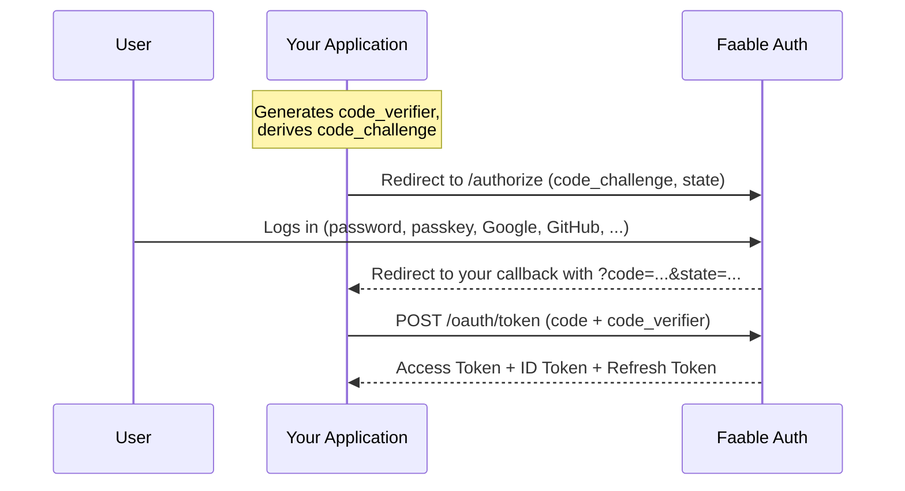

# Authorization Code Flow with PKCE 🔐

The **OAuth 2.0 Authorization Code flow with PKCE** (Proof Key for Code Exchange) is the standard way to **log users in**. The user authenticates on your Faable Auth domain, your app receives a one-time code, and exchanges it for tokens — an **access token** to call your APIs, an **ID token** with the user's identity, and a **refresh token** to keep the session alive.

PKCE adds a cryptographic proof that ties the code to the client that started the flow, so it's safe even for apps that **cannot keep a secret**:

- ✅ Single Page Applications (React, Vue, Angular)
- ✅ Native and mobile apps (iOS, Android, React Native)
- ✅ Server-side web apps (Next.js, Express)

For backend services calling APIs **without a user**, use the [Client Credentials flow](client-credentials.md) instead.

---

## 🔑 What is PKCE, and how does it work?

**PKCE (Proof Key for Code Exchange, [RFC 7636](https://datatracker.ietf.org/doc/html/rfc7636) — pronounced "pixy")** is an extension to the OAuth 2.0 Authorization Code flow that makes it safe for clients that **cannot keep a secret** — single-page apps, mobile, and native apps whose code ships to the user's device.

It closes the **authorization-code interception attack**. Without PKCE, anything that captures the `code` on its way back to your app — a malicious app registered on the same mobile URL scheme, a leaky proxy, browser history — could exchange it for tokens. PKCE ties the code to the exact client that started the flow:

1. Your app generates a random secret, the **`code_verifier`**, and keeps it locally.
2. It sends only the **`code_challenge`** — `base64url(SHA-256(code_verifier))` — when it redirects to `/authorize`. The hash is one-way, so the challenge is useless to an attacker.
3. When exchanging the `code` for tokens, your app sends the original `code_verifier`. Faable recomputes the hash and **rejects the exchange unless it matches** the challenge from step 2.

A stolen `code` is worthless without the `code_verifier`, which never left your app. That is why PKCE is now the recommended practice for **every** client type — including confidential, server-side apps.

### Authorization Code + PKCE vs other flows

| Your app                                                          | Use                                         |
| :---------------------------------------------------------------- | :------------------------------------------ |
| SPA, mobile, native, or server-side web app logging a **user** in | **Authorization Code + PKCE** (this page)   |
| Backend service / cron / CI calling an API with **no user**       | [Client Credentials](client-credentials.md) |
| CLI or device without a browser                                   | [Device Code](device-code.md)               |
| Renewing an access token without re-login                         | [Refresh Token](refresh-token.md)           |

> The older **Implicit flow** (tokens returned in the URL fragment) is deprecated — never put tokens in URLs. Authorization Code + PKCE replaces it for public clients.

---

## 📸 How It Works


```mermaid
sequenceDiagram
    participant User
    participant App as Your Application
    participant Faable as Faable Auth

    Note over App: Generates code_verifier,<br/>derives code_challenge
    App->>Faable: Redirect to /authorize (code_challenge, state)
    User->>Faable: Logs in (password, passkey, Google, GitHub, ...)
    Faable-->>App: Redirect to your callback with ?code=...&state=...
    App->>Faable: POST /oauth/token (code + code_verifier)
    Faable-->>App: Access Token + ID Token + Refresh Token
```

The `code` is single-use and short-lived. Even if it's intercepted, it's useless without the `code_verifier` — which never left your app.

---

## ✅ Prerequisites

From the [Faable Dashboard](https://dashboard.faable.com):

1. **Create a Client** for your application — this gives you the `client_id`. See [Clients](../clients.md).
2. **Add your callback URL** (e.g. `https://your-app.com/callback`) to the client's **Allowed Callback URLs**. Redirects to unlisted URLs are rejected.
3. **Enable at least one connection** on the client — email + password, passwordless, Google, GitHub… See [Connections](../connections.md). What the user sees on the login screen is decided by your tenant's [Login Flow](../login-flows.md).

---

## 🚀 Quick Start with `@faable/auth-js`

The fastest path: our SDK generates the PKCE verifier, handles the redirect, exchanges the code, stores the session, and auto-refreshes tokens.

```ts
import { createClient } from '@faable/auth-js'

const auth = createClient({
  domain: 'your-domain.auth.faable.link',
  clientId: 'YOUR_CLIENT_ID'
})

// 1. Start the login — generates PKCE values and redirects to Faable
const { error } = await auth.signInWithOauthConnection({
  redirectTo: 'https://your-app.com/callback'
  // connection: 'google'   // optional: skip the picker and go straight to one provider
})
if (error) console.error(error) // e.g. redirectTo not in Allowed Callback URLs
```

On your callback page, complete the exchange and read the session:

```ts
// 2. On /callback — exchanges the code for tokens and stores the session
await auth.initialize()

// 3. Anywhere in your app
const { data } = await auth.getSession()
console.log(data.session?.user)
```

That's it — the SDK also refreshes the access token transparently when it expires, using the [Refresh Token flow](refresh-token.md).

> [!IMPORTANT]
> The `redirectTo` URL must be listed in the client's **Allowed Callback URLs** in the dashboard, or the request will be rejected.

> [!TIP]
> **Sending the user back where they were?** Don't bake it into the callback (`redirectTo: '/callback?returnTo=/settings'`) — that makes every page a different callback URL to whitelist. Pass `returnTo` as its own option: the SDK stores it next to the PKCE verifier and hands it back to you after the exchange, while `redirectTo` stays one clean, registered URL.

**Using a framework?** Follow a copy-paste quickstart instead: [React](../quickstart/react.md) · [Next.js](../quickstart/nextjs.md) · [Vue](../quickstart/vue.md) · [SvelteKit](../quickstart/sveltekit.md) · [Angular](../quickstart/angular.md) · [JavaScript (vanilla)](../quickstart/javascript.md) · [React Native](../quickstart/react-native.md).

---

## 🧩 How to Generate the `code_verifier` and `code_challenge`

If you use `@faable/auth-js`, **skip this** — the SDK generates, stores, and sends these for you. Rolling your own? Here's the exact PKCE pair generation.

The **`code_verifier`** is a high-entropy random string (43–128 chars from the unreserved set). The **`code_challenge`** is its SHA-256 hash, base64url-encoded — `code_challenge_method=S256`, the only method Faable supports.

**Browser (Web Crypto API):**

```ts
function base64url(bytes: ArrayBuffer): string {
  return btoa(String.fromCharCode(...new Uint8Array(bytes)))
    .replace(/\+/g, '-')
    .replace(/\//g, '_')
    .replace(/=+$/, '')
}

// code_verifier — 32 random bytes → base64url (~43 chars)
const codeVerifier = base64url(
  crypto.getRandomValues(new Uint8Array(32)).buffer
)

// code_challenge = base64url(SHA-256(code_verifier))
const digest = await crypto.subtle.digest(
  'SHA-256',
  new TextEncoder().encode(codeVerifier)
)
const codeChallenge = base64url(digest)
```

**Node.js:**

```ts
import { createHash, randomBytes } from 'node:crypto'

const codeVerifier = randomBytes(32).toString('base64url')
const codeChallenge = createHash('sha256')
  .update(codeVerifier)
  .digest('base64url')
```

Keep the `code_verifier` until the callback — it must survive the redirect (e.g. `sessionStorage` in a SPA). Send the `code_challenge` on `/authorize`, then send the original `code_verifier` back on the token exchange.

---

## 🛠️ Step-by-Step over HTTP

Implementing it yourself, or curious what the SDK does under the hood? The whole flow is two requests.

### Step 1: Redirect the User to `/authorize`

Generate a random `code_verifier`, derive the challenge as `base64url(sha256(code_verifier))`, and redirect the browser to:

- **Endpoint:** <TennantDomain url="/authorize"/>
- **Method:** `GET` (browser redirect)

```
https://your-domain.auth.faable.link/authorize
  ?response_type=code
  &client_id=YOUR_CLIENT_ID
  &redirect_uri=https://your-app.com/callback
  &scope=openid profile email
  &state=RANDOM_OPAQUE_VALUE
  &code_challenge=BASE64URL_SHA256_OF_VERIFIER
  &code_challenge_method=S256
  &audience=https://api.myapp.com
```

| Parameter               | Required    | Description                                                                                                                                                                                                                   |
| :---------------------- | :---------- | :---------------------------------------------------------------------------------------------------------------------------------------------------------------------------------------------------------------------------- |
| `response_type`         | Yes         | Must be `code` (it is also the default if omitted).                                                                                                                                                                           |
| `client_id`             | Yes         | Your application's Client ID.                                                                                                                                                                                                 |
| `redirect_uri`          | Yes         | Where to send the user after login. Must be in the client's **Allowed Callback URLs**.                                                                                                                                        |
| `scope`                 | Recommended | Space-separated. Use `openid profile email` to get an ID token with the user's profile. Add your API's scopes (e.g. `read:orders`) to have them in the access token.                                                          |
| `state`                 | Recommended | Opaque random value echoed back on the callback. **Verify it matches** to prevent CSRF.                                                                                                                                       |
| `code_challenge`        | Recommended | `base64url(sha256(code_verifier))`. Enables PKCE. If you send it, `code_challenge_method` becomes required.                                                                                                                   |
| `code_challenge_method` | Recommended | Only `S256` is supported; `plain` is rejected.                                                                                                                                                                                |
| `audience`              | No          | Identifier of the [API](../apis.md) the access token should target — sets its `aud` claim. Without it the access token is only good for [UserInfo](../oidc/userinfo.md), and an API that validates `aud` will reject it.      |
| `resource`              | No          | [RFC 8707](https://datatracker.ietf.org/doc/html/rfc8707) alias of `audience`, for libraries that use the standard name. Must be a valid URI.                                                                                 |
| `connection`            | No          | Which [connection](../connections.md) to use (e.g. `google`, or a connection id) — skips the picker and goes straight to that provider. `connection_id` is accepted as an alias. Defaults to the client's default connection. |
| `nonce`                 | No          | OIDC replay protection — echoed in the issued `id_token`.                                                                                                                                                                     |
| `prompt`                | No          | Controls the login UI — see [Controlling the prompt](#controlling-the-prompt).                                                                                                                                                |

### Step 2: The User Logs In

Faable shows your tenant's login screen and the user authenticates with any connection you've enabled — email/password, passkey, passwordless OTP, Google, GitHub, or a custom provider. The exact sequence of screens (email first, second factor, "remember me", passkey offer) is your tenant's [Login Flow](../login-flows.md); branding lives in [Login Experience](../login-experience.md). Your app doesn't change for any of it.

If the user already has an active session on your Faable domain (they logged in to another of your apps, or ticked "remember me"), this step is skipped and the redirect happens immediately — that's single sign-on. Send `prompt=login` to force the screen anyway.

### Step 3: Receive the Code on Your Callback

On success, the browser lands back on your app:

```
https://your-app.com/callback?code=AUTHORIZATION_CODE&state=RANDOM_OPAQUE_VALUE
```

Verify that `state` matches the value you sent in Step 1. On failure (e.g. the user cancels, or `prompt=none` needed interaction), the redirect carries an error instead:

```
https://your-app.com/callback?error=access_denied&error_description=...&state=...
```

### Step 4: Exchange the Code for Tokens

From your app, `POST` the code to the token endpoint together with the original `code_verifier`:

- **Endpoint:** <TennantDomain url="/oauth/token"/>
- **Content-Type:** `application/x-www-form-urlencoded` or `application/json`

```bash
curl --request POST \
  --url 'https://your-domain.auth.faable.link/oauth/token' \
  --header 'content-type: application/x-www-form-urlencoded' \
  --data 'grant_type=authorization_code' \
  --data 'client_id=YOUR_CLIENT_ID' \
  --data 'code=AUTHORIZATION_CODE' \
  --data 'code_verifier=ORIGINAL_CODE_VERIFIER' \
  --data 'redirect_uri=https://your-app.com/callback'
```

| Field           | Required | Description                                                                                          |
| :-------------- | :------- | :--------------------------------------------------------------------------------------------------- |
| `grant_type`    | Yes      | `authorization_code`.                                                                                |
| `client_id`     | Yes      | The **same** client that started the flow — the code is bound to it.                                 |
| `code`          | Yes      | The value from the callback.                                                                         |
| `code_verifier` | Yes\*    | The original verifier. \*Required whenever you sent a `code_challenge` in Step 1 — which you should. |
| `redirect_uri`  | Yes      | The same `redirect_uri` as in Step 1.                                                                |

No `client_secret` is needed: PKCE is the proof. Calling from the browser? The request must come from an origin listed in the client's **Allowed Web Origins**, or the CORS preflight fails.

### Response

```json
{
  "access_token": "eyJhbGciOiJSUzI1NiIs...",
  "id_token": "eyJhbGciOiJSUzI1NiIs...",
  "refresh_token": "v1.MRjD...",
  "token_type": "Bearer",
  "expires_in": 86400
}
```

| Field           | Description                                                                                                                                                                |
| :-------------- | :------------------------------------------------------------------------------------------------------------------------------------------------------------------------- |
| `access_token`  | Signed JWT (RS256) for calling your APIs. Send it as `Authorization: Bearer <token>` — see [Validate Access Tokens](../validate-access-tokens.md) for the server side.     |
| `id_token`      | OIDC JWT with the user's identity claims (`sub`, `email`, `name`, ...). Its `aud` is your `client_id`.                                                                     |
| `refresh_token` | Use it to obtain new access tokens without re-authenticating — see [Refresh Token flow](refresh-token.md). Always returned by this flow; no `offline_access` scope needed. |
| `expires_in`    | Access token lifetime in **seconds**, controlled by the target API's `token_lifetime` (default: 86400 = 24 h).                                                             |

> [!NOTE]
> The authorization `code` is **single-use** — it is consumed and invalidated on the first exchange, and it expires on its own after an hour. A second exchange with the same code fails with `state not found`.

---

## 🎛️ Controlling the Prompt

The optional `prompt` parameter on `/authorize` controls whether the user sees the login UI. It accepts a space-separated list:

| Value            | Behavior                                                                                                                                                           |
| :--------------- | :----------------------------------------------------------------------------------------------------------------------------------------------------------------- |
| `none`           | **SSO probe.** No UI is ever displayed; the request errors if interaction would be needed. Must be the only value. Useful for silent re-authentication from a SPA. |
| `login`          | Forces the user to re-authenticate, even with an active session.                                                                                                   |
| `consent`        | Forces the consent step before issuing tokens. Currently behaves like `login` (a dedicated consent screen is on the roadmap).                                      |
| `select_account` | Accepted for compatibility but currently ignored.                                                                                                                  |

Unknown prompt values are accepted silently. Most applications can leave `prompt` unset.

---

## ⚠️ Common Errors

Errors on `/authorize` are returned to your `redirect_uri` as `?error=...&error_description=...` query parameters, except for malformed requests, which get a `400` before any redirect. Errors on the token exchange return an OAuth 2.0 error body (`{ "error": "...", "error_description": "..." }`). These are the messages the server actually returns:

| Where        | Error                               | Cause / Fix                                                                                                                                                           |
| :----------- | :---------------------------------- | :-------------------------------------------------------------------------------------------------------------------------------------------------------------------- |
| `/authorize` | Callback URL rejected               | The `redirect_uri` is not in the client's **Allowed Callback URLs**. Add it in the dashboard — exact match, scheme and path included.                                 |
| `/authorize` | `Missing code_challenge_method`     | You sent `code_challenge` without the method. Add `code_challenge_method=S256`.                                                                                       |
| `/authorize` | `Only S256 method is supported`     | `code_challenge_method=plain`. Hash the verifier with SHA-256 and send `S256`.                                                                                        |
| `/authorize` | `login_required` with `prompt=none` | No active session and interaction was forbidden. Fall back to an interactive login.                                                                                   |
| `/authorize` | No database connection available    | The client has no enabled connection and no default. Enable one under [Connections](../connections.md) or pass `connection`.                                          |
| Token `400`  | `Missing code`                      | The `code` parameter is absent — usually the callback handler read the wrong query key.                                                                               |
| Token `400`  | `state not found`                   | The code was already used, expired (1 hour), or was issued by a different client. Restart the flow to get a fresh one.                                                |
| Token `400`  | `Code Verifier is not valid`        | The `code_verifier` doesn't hash to the `code_challenge` sent at `/authorize`. Use the exact original value — a common cause is regenerating it on the callback page. |
| Token `400`  | `No challenge present in state`     | You sent a `code_verifier` but no `code_challenge` at `/authorize`. Send both, or neither.                                                                            |
| Token `401`  | `Bad client_id`                     | The code was issued to a different client. Use the same `client_id` in both steps.                                                                                    |
| Token (CORS) | Preflight fails from the browser    | Your app's origin isn't in the client's **Allowed Web Origins**. Add it.                                                                                              |

---

## 🔒 Security Best Practices

- **Always use PKCE**, even in server-side apps. It's the current OAuth 2.0 best practice for every client type.
- **Always send and verify `state`.** It's your CSRF protection on the callback.
- **Always send `audience`** when the access token is for your API. Your API should reject tokens whose `aud` is the UserInfo URL — see [Validate Access Tokens](../validate-access-tokens.md).
- **Never put tokens in URLs.** The code flow exists precisely so tokens travel in a POST response body, not in the address bar or browser history.
- **Register exact callback URLs.** Prefer full paths (`https://app.com/auth/callback`) over broad patterns, and keep the list short.
- **Let the SDK store the session.** `@faable/auth-js` handles storage, rotation, and cross-tab sync for you.

---

## ❓ FAQ

### Do I need a `client_secret` for this flow?

No. PKCE replaces the secret for public clients (SPAs, mobile). That's the point: the flow is secure without shipping any secret to the browser.

### What is PKCE, in one sentence?

Your app invents a random secret (`code_verifier`), sends only its hash when the flow starts, and reveals the secret when exchanging the code — proving both requests came from the same app.

### Does this flow return a refresh token?

Yes, always — you don't need to request an `offline_access` scope. Use it with the [Refresh Token flow](refresh-token.md) to renew access tokens silently. The `@faable/auth-js` SDK does this automatically.

### How do users actually log in?

With whatever [connections](../connections.md) you enable on the client: email/password, passkeys, passwordless OTP, Google, GitHub, or custom OIDC providers. The screens they go through — email first, second factor, remember me — are configured per tenant in [Login Flows](../login-flows.md). The OAuth flow your app implements is identical for all of them.

### When should I use Client Credentials instead?

When there is no user — a backend service, cron job, or CI pipeline calling an API. See [Client Credentials](client-credentials.md).

### How do I generate a `code_verifier` and `code_challenge`?

The verifier is a random high-entropy string; the challenge is `base64url(SHA-256(verifier))`. See [How to Generate the code_verifier and code_challenge](#how-to-generate-the-code_verifier-and-code_challenge) for copy-paste browser and Node snippets — or let `@faable/auth-js` do it for you.

### Is PKCE required?

For public clients (SPA, mobile, native) it's mandatory in practice — the flow is unsafe without it. For confidential server-side clients it's strongly recommended and the current OAuth 2.0 best practice. Faable supports it for every client type.

### What is `code_challenge_method=S256`?

It tells the server the challenge is the SHA-256 hash of the verifier (not the plaintext). `S256` is the only method Faable accepts — plain challenges are rejected.

### Why does my API reject the access token from this flow?

Almost always because the `/authorize` request had no `audience`. Without it the access token's `aud` is your tenant's `/userinfo` URL, and any API that validates the audience (as it should) rejects it. Add `audience=<your API identifier>` to Step 1.

### Can I skip the login screen for a specific provider?

Yes — pass `connection=google` (or the connection's id) on `/authorize`, or `connection: 'google'` to the SDK. The user goes straight to that provider instead of the picker.

---

## 🔗 Related

- **[@faable/auth-js](https://www.npmjs.com/package/@faable/auth-js)** — official JavaScript/TypeScript SDK; PKCE handled for you.
- **[Validate Access Tokens](../validate-access-tokens.md)** — what your API does with the token this flow returns.
- **[Refresh Token Flow](refresh-token.md)** — silent session renewal.
- **[Login Flows](../login-flows.md)** — configure what the user sees between Step 1 and Step 3.
- **[Clients](../clients.md)** — register your app and configure callback URLs and web origins.
- **[Connections](../connections.md)** — enable social, passwordless, and enterprise login methods.
- **[RFC 6749 §4.1 — Authorization Code Grant](https://datatracker.ietf.org/doc/html/rfc6749#section-4.1)** — the official OAuth 2.0 standard.
- **[RFC 7636 — Proof Key for Code Exchange](https://datatracker.ietf.org/doc/html/rfc7636)** — the PKCE specification.
