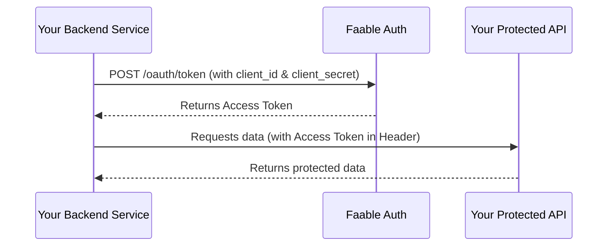

# OAuth 2.0: Client Credentials Flow 🤖

The **OAuth 2.0 Client Credentials Flow** is the standard for machine-to-machine (M2M) communication. It is used when an application (the Client) needs to access its own resources or call an authorized API, without the presence of a human user.

Since this flow involves a **Client Secret**, it must only be performed by secure back-end services.

---

## 📸 Flow Overview



---

## 🛠️ Implementation

### Step 1: Request an Access Token

To obtain a token, your application must make a `POST` request to the Faable Auth token endpoint.

- **Endpoint:** <TennantDomain url="/oauth/token"/>
- **Method:** `POST`
- **Content-Type:** `application/json`

#### Request Body

| Parameter       | Type   | Required | Description                                          |
| :-------------- | :----- | :------- | :--------------------------------------------------- |
| `grant_type`    | string | Yes      | Must be `client_credentials`.                        |
| `client_id`     | string | Yes      | Your application’s Client ID.                        |
| `client_secret` | string | Yes      | Your application’s Client Secret.                    |
| `audience`      | string | No       | The unique identifier of the API you want to access. |

### Step 2: Use the Access Token

The response will contain an `access_token` that you can use to authenticate your requests to your API.

---

## 🚀 Example with `curl`

You can test the flow quickly using this command:

```bash
curl --request POST \
  --url 'https://your-domain.auth.faable.link/oauth/token' \
  --header 'content-type: application/json' \
  --data '{
    "client_id": "YOUR_CLIENT_ID",
    "client_secret": "YOUR_CLIENT_SECRET",
    "audience": "YOUR_API_IDENTIFIER",
    "grant_type": "client_credentials"
  }'
```

> [!CAUTION]
> Never use the Client Credentials flow on the front-end (browser, mobile app). This flow requires a **Client Secret**, which must remain confidential and should only be stored securely on your server.

---

## 🔗 Related Sections

- **[Clients](../clients.md)**: Learn about Client IDs and Secrets.
- **[Authorization Code Flow](authorization-code.md)**: For user-interactive applications.
- **[API Reference](https://faable.auth.faable.link/docs/json)**: Full OpenAPI specification.
- **[RFC 6749 - Client Credentials Grant](https://datatracker.ietf.org/doc/html/rfc6749#section-4.4)**: Official OAuth 2.0 standard for this flow.
