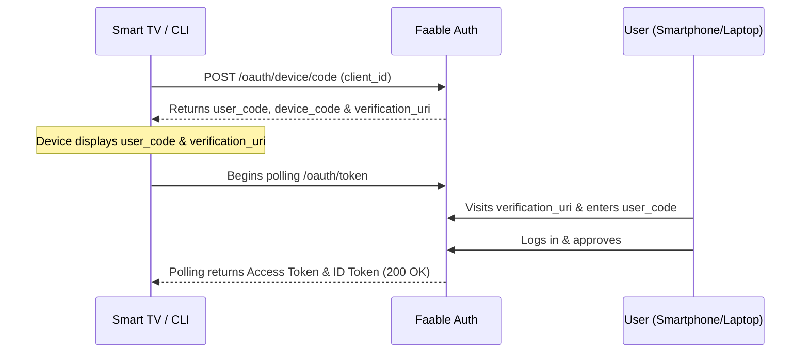

# OAuth 2.0: Device Code Flow 📺

The **OAuth 2.0 Device Authorization Grant** (or Device Flow) is designed for devices that are connected to the internet but have limited or no input capabilities, such as Smart TVs, CLI tools, IoT devices, or printers.

Because these devices lack a web browser or a practical way to enter credentials, the flow delegates the actual login process to a secondary device (like a smartphone or laptop) that does have a browser.

---

## 📸 Flow Overview



---

## 🛠️ Implementation

Implementing the Device Flow with Faable Auth requires two phases of interaction with the API.

### Phase 1: Request Device and User Codes

The device makes an initial request to obtain the codes and instructions for the user.

- **Endpoint:** <TennantDomain url="/oauth/device/code"/>
- **Method:** `POST`
- **Content-Type:** `application/json`

#### Request Body

| Parameter   | Type   | Required | Description                   |
| :---------- | :----- | :------- | :---------------------------- |
| `client_id` | string | Yes      | Your application’s Client ID. |

#### Response from Faable

Faable will return a JSON payload with the following fields:
| Field | Description |
| :--- | :--- |
| `device_code` | The internal identifier of the session. Keep this private on the device. |
| `user_code` | A short identifier (e.g., `ABCD-1234`) to display to the user. |
| `verification_uri` | The Faable URL the user must visit (e.g., `https://faable.com/activate`). |
| `expires_in` | The time (in seconds) until the code expires. |
| `interval` | The minimum time (in seconds) the device should wait between polling requests. |

### Phase 2: Polling the Token Endpoint

While the user completes the login process on their secondary device, the requesting device will periodically poll the standard token endpoint to check if authorization is complete.

- **Endpoint:** <TennantDomain url="/oauth/token"/>
- **Method:** `POST`
- **Content-Type:** `application/json`

#### Request Body

| Parameter     | Type   | Required | Description                                             |
| :------------ | :----- | :------- | :------------------------------------------------------ |
| `grant_type`  | string | Yes      | Must be `urn:ietf:params:oauth:grant-type:device_code`. |
| `client_id`   | string | Yes      | Your application’s Client ID.                           |
| `device_code` | string | Yes      | The `device_code` obtained in the first phase.          |

#### Expected Server Responses

Depending on the user's progress, the token endpoint will return one of the following scenarios:

| Scenario                | HTTP Status       | Error Code              | Description                                                              |
| :---------------------- | :---------------- | :---------------------- | :----------------------------------------------------------------------- |
| **Pending Validation**  | `400 Bad Request` | `authorization_pending` | The user hasn't completed the login yet. The device should keep polling. |
| **Polling Too Fast**    | `400 Bad Request` | `slow_down`             | The device is ignoring the `interval` limit. Increase the wait time.     |
| **Code Expired**        | `400 Bad Request` | `expired_token`         | The user took too long. The application must start a new request.        |
| **Success (Validated)** | `200 OK`          | _(None)_                | Returns a JSON object with the `access_token` and `id_token`.            |

---

## 🚀 Example with `curl`

### 1. Request the code

```bash
curl --request POST \
  --url 'https://your-domain.auth.faable.link/oauth/device/code' \
  --header 'content-type: application/json' \
  --data '{
    "client_id": "YOUR_CLIENT_ID"
  }'
```

### 2. Poll for the token

```bash
curl --request POST \
  --url 'https://your-domain.auth.faable.link/oauth/token' \
  --header 'content-type: application/json' \
  --data '{
    "client_id": "YOUR_CLIENT_ID",
    "device_code": "THE_INTERNAL_DEVICE_CODE",
    "grant_type": "urn:ietf:params:oauth:grant-type:device_code"
  }'
```

---

## 🔗 Related Sections

- **[RFC 8628 - OAuth 2.0 Device Authorization Grant](https://datatracker.ietf.org/doc/html/rfc8628)**: Official standard for the Device Flow.
