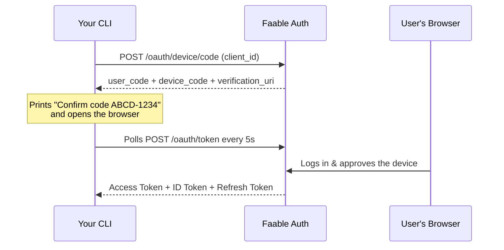

# Device Code Flow: Login for Your CLI 💻

You're building a CLI tool and you want a `yourcli login` command that works like the ones from GitHub, Vercel, or Fly: the terminal shows a short code, the user confirms it in the browser, and the CLI is authenticated — no passwords typed into the terminal, no secrets shipped in your binary.

That's the **OAuth 2.0 Device Authorization Grant** (RFC 8628), and Faable Auth gives it to you out of the box. It works anywhere a browser isn't available:

- ✅ **CLI tools** — `yourcli login` (the main event; this is exactly how Faable's own `faable login` works)
- ✅ Smart TVs and set-top boxes
- ✅ IoT devices, kiosks, and printers

For apps that **do** run in a browser or on mobile, use the [Authorization Code flow](authorization-code.md) with the **`@faable/auth-js`** SDK instead.

---

## 📸 How It Works



The terminal never sees the user's credentials — the login happens entirely in the user's browser, with whatever [connections](../connections.md) you've enabled (Google, GitHub, email/password, passwordless...).

---

## ✅ Prerequisites

Create a **Client** for your CLI in the [Faable Dashboard](https://dashboard.faable.com) — you only need its `client_id`. CLIs are public clients: **no `client_secret` is involved**, so there's nothing sensitive to embed in your binary. See [Clients](../clients.md).

---

## 🛠️ Step 1: Request the Codes

When the user runs `yourcli login`, ask Faable for a code pair:

- **Endpoint:** <TennantDomain url="/oauth/device/code"/>
- **Method:** `POST`
- **Content-Type:** `application/x-www-form-urlencoded` or `application/json`

### Request Parameters

| Parameter     | Required | Description                                                                                                  |
| :------------ | :------- | :------------------------------------------------------------------------------------------------------------ |
| `client_id`   | Yes      | Your application's Client ID.                                                                                  |
| `scope`       | No       | Space-separated. Use `openid profile email offline_access` to also receive a refresh token so the user stays logged in across runs. |
| `audience`    | No       | Identifier of the [API](../apis.md) the access token should target.                                            |
| `device_name` | No       | Human-friendly name (e.g. `marcs-mbp (macOS)`) shown on the approval page so the user recognizes which device is asking. |

```bash
curl --request POST \
  --url 'https://your-domain.auth.faable.link/oauth/device/code' \
  --header 'content-type: application/json' \
  --data '{
    "client_id": "YOUR_CLIENT_ID",
    "scope": "openid profile email offline_access",
    "device_name": "marcs-mbp (macOS)"
  }'
```

### Response

```json
{
  "device_code": "GmRhmhcxhwAzkoEqiMEg_DnyEysNkuNhszIySk9eS",
  "user_code": "ABCD-1234",
  "verification_uri": "https://your-domain.auth.faable.link/activate",
  "verification_uri_complete": "https://your-domain.auth.faable.link/activate?user_code=ABCD-1234",
  "expires_in": 300,
  "interval": 5
}
```

| Field                       | Description                                                                                      |
| :-------------------------- | :-------------------------------------------------------------------------------------------------- |
| `device_code`               | The CLI's private handle for polling. **Never display it.**                                          |
| `user_code`                 | The short code to show the user in the terminal.                                                     |
| `verification_uri`          | The URL (on your tenant domain) where the user enters the code.                                      |
| `verification_uri_complete` | Same URL with the code pre-filled — open it in the default browser, or render it as a QR code on a TV. |
| `expires_in`                | The codes expire in **300 seconds (5 minutes)**. Start over if the user takes longer.                |
| `interval`                  | Minimum seconds between polls: **5**. Polling faster returns `slow_down`.                            |

### Step 2: Show the Code and Open the Browser

Print the `user_code` and open `verification_uri_complete` in the default browser (fall back to printing the URL when there's no display, e.g. over SSH). The user logs in and approves — the approval page shows your `device_name`.

```
$ yourcli login
Opening https://your-domain.auth.faable.link/activate?user_code=ABCD-1234
Confirm this code in your browser: ABCD-1234
Waiting for approval...
```

### Step 3: Poll for the Token

While the user approves, poll the token endpoint every `interval` seconds:

- **Endpoint:** <TennantDomain url="/oauth/token"/>
- **Method:** `POST`

| Parameter     | Required | Description                                             |
| :------------ | :------- | :------------------------------------------------------- |
| `grant_type`  | Yes      | Must be `urn:ietf:params:oauth:grant-type:device_code`.   |
| `client_id`   | Yes      | The same Client ID used in Step 1.                        |
| `device_code` | Yes      | The `device_code` from Step 1.                            |

```bash
curl --request POST \
  --url 'https://your-domain.auth.faable.link/oauth/token' \
  --header 'content-type: application/json' \
  --data '{
    "grant_type": "urn:ietf:params:oauth:grant-type:device_code",
    "client_id": "YOUR_CLIENT_ID",
    "device_code": "THE_DEVICE_CODE"
  }'
```

### Polling Responses

| Scenario            | Status | `error`                 | What to do                                                        |
| :------------------ | :----- | :----------------------- | :------------------------------------------------------------------ |
| Waiting for user    | `400`  | `authorization_pending`  | Keep polling at the `interval`.                                      |
| Polling too fast    | `400`  | `slow_down`              | You polled less than 5 s after the previous attempt. Back off.       |
| Code expired        | `400`  | `expired_token`          | The 5-minute window passed. Request a new code pair (Step 1).        |
| Wrong client        | `401`  | `invalid_client`         | The `client_id` doesn't match the one that requested the code.       |
| **Approved** ✅     | `200`  | —                        | Token response — stop polling.                                       |

### Success Response

```json
{
  "access_token": "eyJhbGciOiJSUzI1NiIs...",
  "id_token": "eyJhbGciOiJSUzI1NiIs...",
  "refresh_token": "v1.MRjD...",
  "token_type": "Bearer",
  "expires_in": 86400
}
```

Your CLI gets the full token set: an **access token** to call your API on behalf of the user, an **ID token** with their identity (handy for `yourcli whoami`), and a **refresh token** to keep them logged in across runs via the [Refresh Token flow](refresh-token.md).

> [!NOTE]
> The `device_code` is **single-use**: it is deleted the moment tokens are issued. Any further poll with it returns `expired_token`.

---

## 💻 Complete Example: a `login` Command in Node.js

The full loop — request codes, open the browser, poll, and land on a session. This mirrors what `faable login` does in production:

```ts
import os from "os";

const AUTH_DOMAIN = "https://your-domain.auth.faable.link";
const CLIENT_ID = "YOUR_CLIENT_ID";

async function loginCommand() {
  // Step 1: request the code pair
  const codeRes = await fetch(`${AUTH_DOMAIN}/oauth/device/code`, {
    method: "POST",
    headers: { "content-type": "application/json" },
    body: JSON.stringify({
      client_id: CLIENT_ID,
      scope: "openid profile email offline_access",
      device_name: `${os.hostname()} (${process.platform})`,
    }),
  });
  const { device_code, user_code, verification_uri_complete, interval } =
    await codeRes.json();

  // Step 2: show the code and let the user approve in the browser
  console.log(`Open ${verification_uri_complete}`);
  console.log(`and confirm the code: ${user_code}`);

  // Step 3: poll until approved
  while (true) {
    await new Promise((r) => setTimeout(r, interval * 1000));

    const tokenRes = await fetch(`${AUTH_DOMAIN}/oauth/token`, {
      method: "POST",
      headers: { "content-type": "application/json" },
      body: JSON.stringify({
        grant_type: "urn:ietf:params:oauth:grant-type:device_code",
        client_id: CLIENT_ID,
        device_code,
      }),
    });

    if (tokenRes.ok) return tokenRes.json(); // { access_token, id_token, refresh_token, ... }

    const { error } = await tokenRes.json();
    if (error === "authorization_pending") continue;
    if (error === "slow_down") continue; // next loop already waits `interval`
    throw new Error(`Login failed: ${error}`); // expired_token, invalid_client
  }
}

const { access_token, refresh_token } = await loginCommand();
console.log("You are logged in!");
```

> [!TIP]
> Persist the `refresh_token` (OS keychain, or a config file like `~/.yourcli/credentials` with `0600` permissions) and use the [Refresh Token flow](refresh-token.md) on the next run — your users log in once, not on every invocation.

---

## ❓ FAQ

**Do I need a `client_secret` in my CLI?**
No. CLIs are public clients — the flow is designed to work with only the `client_id`, so there's nothing secret to embed (or leak) in your distributed binary.

**How do I keep the user logged in between CLI runs?**
Request the `offline_access` scope, store the returned `refresh_token` securely, and exchange it for a fresh access token on startup with the [Refresh Token flow](refresh-token.md).

**How long does the user have to approve?**
5 minutes (`expires_in: 300`). After that, request a new code pair and show a fresh `user_code`.

**How does the user log in on the approval page?**
With any [connection](../connections.md) you've enabled — email/password, passwordless OTP, Google, GitHub, or custom providers. Your CLI inherits your entire login stack for free.

**Can I use `@faable/auth-js` for this flow?**
The device flow is plain HTTP by design (it targets environments where a browser SDK doesn't apply), so you implement the loop above directly. Use `@faable/auth-js` for your browser and mobile apps — same tenant, same users, same tokens.

**Does this also work for Smart TVs and IoT?**
Yes — the flow is identical. Render `verification_uri_complete` as a QR code instead of opening a browser, and the user approves from their phone.

---

## 🔗 Related

- **[Refresh Token Flow](refresh-token.md)** — keep the CLI session alive after the first login.
- **[Authorization Code Flow](authorization-code.md)** — login for apps that do have a browser, via `@faable/auth-js`.
- **[Clients](../clients.md)** — register your CLI application.
- **[Connections](../connections.md)** — the login methods available to your users.
- **[RFC 8628 — OAuth 2.0 Device Authorization Grant](https://datatracker.ietf.org/doc/html/rfc8628)** — the official standard.
