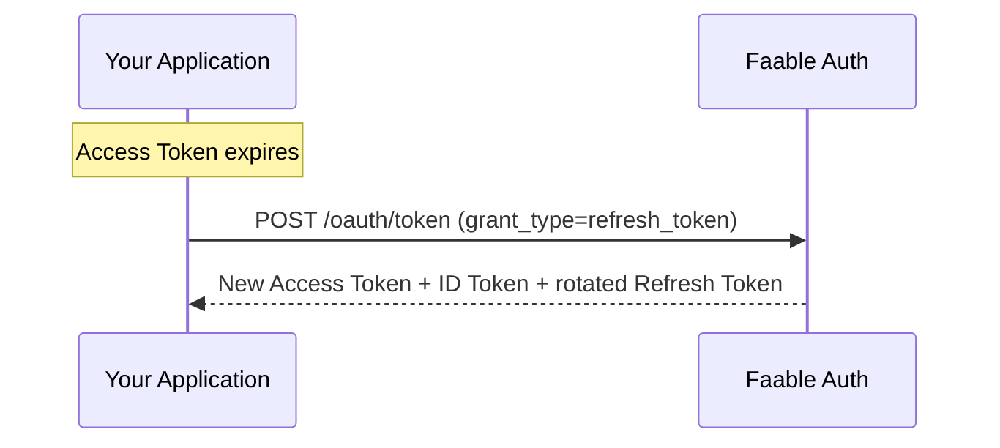

# Refresh Token Flow 🔄

Access tokens are short-lived on purpose — a leaked token expires quickly. The **Refresh Token flow** lets your application obtain a fresh access token **without sending the user back through login**, keeping sessions seamless while the tokens stay short-lived.

You receive a refresh token when a user authenticates with the [Authorization Code flow](authorization-code.md) or the [Device Code flow](device-code.md). Store it, and exchange it whenever the access token expires.

> [!TIP]
> If you use **`@faable/auth-js`**, you can skip this page entirely: the SDK refreshes tokens automatically in the background. Read on if you're curious or implementing the flow yourself.

---

## 📸 How It Works



Every refresh returns a **new refresh token** (rotation). Always store the latest one and use it for the next refresh.

---

## 🚀 Automatic Refresh with `@faable/auth-js`

The SDK manages the whole lifecycle: it stores the session, runs a background ticker, and exchanges the refresh token before the access token expires — across tabs, transparently.

```ts
import { createClient } from "@faable/auth-js";

const auth = createClient({
  domain: "your-domain.auth.faable.link",
  clientId: "YOUR_CLIENT_ID",
});

// That's it — sessions refresh automatically in the background.
const { data } = await auth.getSession();
```

### Forcing a Manual Refresh

Need a guaranteed-fresh token — for example right after a server-side change to the user's claims? Call `refreshSession()`:

```ts
const { data, error } = await auth.refreshSession();

if (!error) {
  console.log("New access token:", data.session.access_token);
}
```

---

## 🛠️ Refreshing over HTTP

Implementing it yourself (a backend, a CLI, a non-JS stack)? It's a single request.

- **Endpoint:** <TennantDomain url="/oauth/token"/>
- **Method:** `POST`
- **Content-Type:** `application/x-www-form-urlencoded` or `application/json`

### Request Parameters

| Parameter       | Required | Description                                                                                                       |
| :-------------- | :------- | :----------------------------------------------------------------------------------------------------------------- |
| `grant_type`    | Yes      | Must be `refresh_token`.                                                                                            |
| `client_id`     | Yes      | Your application's Client ID.                                                                                       |
| `refresh_token` | Yes      | The most recent refresh token you received.                                                                         |
| `scope`         | No       | Space-separated. May only **narrow** the original grant — scopes not present in the original token are dropped (RFC 6749 §6). |

The token's `audience` is preserved automatically from the original grant — you don't (and can't) change it on refresh.

### Example with `curl`

```bash
curl --request POST \
  --url 'https://your-domain.auth.faable.link/oauth/token' \
  --header 'content-type: application/x-www-form-urlencoded' \
  --data 'grant_type=refresh_token' \
  --data 'client_id=YOUR_CLIENT_ID' \
  --data 'refresh_token=YOUR_REFRESH_TOKEN'
```

### Response

```json
{
  "access_token": "eyJhbGciOiJSUzI1NiIs...",
  "id_token": "eyJhbGciOiJSUzI1NiIs...",
  "refresh_token": "v1.NEW_ROTATED_TOKEN...",
  "token_type": "Bearer",
  "expires_in": 86400
}
```

| Field           | Description                                                                                                     |
| :-------------- | :---------------------------------------------------------------------------------------------------------------- |
| `access_token`  | Fresh JWT, same `aud` as the original grant.                                                                       |
| `id_token`      | Refreshed OIDC identity token. Keeps the original `nonce`, `auth_time`, and session id (`sid`) per the OIDC spec.  |
| `refresh_token` | **A new, rotated refresh token.** Replace the stored one with this value.                                          |
| `expires_in`    | New access token lifetime in **seconds** (from the target API's `token_lifetime`, default 86400 = 24 h).           |

---

## ⚠️ Common Errors

Errors use the standard OAuth 2.0 format: `{ "error": "...", "error_description": "..." }`.

| Status | Error                     | Cause / Fix                                                                                          |
| :----- | :------------------------- | :----------------------------------------------------------------------------------------------------- |
| `400`  | Missing `refresh_token`    | Include the parameter in the request body.                                                              |
| `400`  | Bad decoded token          | The value isn't a valid refresh token. Check you're not sending an access token by mistake.             |
| `400`  | `invalid_grant`            | The API (`audience`) the token was issued for no longer exists. Stop retrying and re-authenticate the user. |
| `429`  | Rate limit exceeded        | You're refreshing too often. Refresh only when the access token is about to expire — or let `@faable/auth-js` schedule it for you. |

> [!IMPORTANT]
> Refresh only when needed — not on every request. The token endpoint is rate-limited per client, and a refresh loop (e.g. refreshing a 24-hour token every minute) will get throttled with `429` responses.

---

## ❓ FAQ

**Where do I get a refresh token in the first place?**
From a user login: the [Authorization Code flow](authorization-code.md) and the [Device Code flow](device-code.md) both return one alongside the access token.

**Why is a new refresh token returned every time?**
Rotation limits the damage of a leaked token: each refresh token is superseded by the next one. Always persist the latest value.

**Can I extend the scopes when refreshing?**
No — RFC 6749 §6 only allows narrowing. Scopes not granted originally are silently dropped. To gain new scopes, send the user through login again.

**Does the Client Credentials flow use refresh tokens?**
No. Machine-to-machine clients simply [request a new token](client-credentials.md) with their credentials when the current one expires.

**Do I have to implement any of this in a browser app?**
No — use `@faable/auth-js` and it's fully automatic, including multi-tab session sync.

---

## 🔗 Related

- **[@faable/auth-js](https://www.npmjs.com/package/@faable/auth-js)** — official SDK with automatic token refresh built in.
- **[Authorization Code Flow](authorization-code.md)** — where refresh tokens are first obtained.
- **[Device Code Flow](device-code.md)** — login for CLIs and browser-less devices, also returns a refresh token.
- **[Clients](../clients.md)** — application configuration.
- **[RFC 6749 §6 — Refreshing an Access Token](https://datatracker.ietf.org/doc/html/rfc6749#section-6)** — the official standard.
