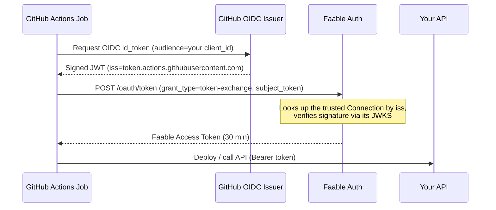

# Token Exchange 🔁

The **OAuth 2.0 Token Exchange grant** (RFC 8693) lets a workload that already has a JWT from a trusted issuer — most commonly a **GitHub Actions job with its OIDC token** — exchange it for a Faable Auth access token. No API keys stored in CI, no secrets to rotate or leak: trust is established cryptographically between issuers.

Use it for:

- ✅ **Keyless CI/CD** — a GitHub Actions workflow authenticates as _itself_ (`repo:org/repo:ref:refs/heads/main`) to call your API
- ✅ Workload identity federation — services holding a JWT from their own OIDC issuer
- ✅ Replacing long-lived machine secrets with short-lived, verifiable identity

This is **workload identity, not user login**: no Faable user is looked up or created. The issued token identifies the external workload itself. For user login use the [Authorization Code flow](authorization-code.md); for services that can hold a secret, [Client Credentials](client-credentials.md) is simpler.

---

## 📸 How It Works



Faable reads the incoming token's `iss` claim, finds the **[Connection](../connections.md)** you configured for that issuer, verifies the token's signature against the connection's JWKS, and mints a Faable-signed access token carrying the external identity.

---

## ✅ Prerequisites

From the [Faable Dashboard](https://dashboard.faable.com):

1. **A Client** — its `client_id` identifies the exchanging application.
2. **An OIDC Connection acting as the trust anchor**, configured with:

| Connection field | Purpose                                                                                                                                                               |
| :--------------- | :-------------------------------------------------------------------------------------------------------------------------------------------------------------------- |
| `issuer`         | The external issuer to trust — must equal the subject token's `iss` (e.g. `https://token.actions.githubusercontent.com`).                                             |
| `jwks_url`       | Where to fetch the issuer's public keys. If omitted, Faable tries `<issuer>/.well-known/jwks` — set it explicitly unless your issuer serves keys there (GitHub does). |
| `client_id`      | The expected `aud` of the subject token. The workload must request its OIDC token with this audience.                                                                 |
| `claims_mapping` | Optional — which external claims to copy into the issued Faable token (see below).                                                                                    |

---

## 🛠️ The Exchange Request

- **Endpoint:** <TennantDomain url="/oauth/token"/>
- **Method:** `POST`
- **Content-Type:** `application/x-www-form-urlencoded` or `application/json`

| Parameter            | Required | Description                                                              |
| :------------------- | :------- | :----------------------------------------------------------------------- |
| `grant_type`         | Yes      | Must be `urn:ietf:params:oauth:grant-type:token-exchange`.               |
| `subject_token`      | Yes      | The external JWT to exchange (e.g. the GitHub Actions OIDC token).       |
| `subject_token_type` | Yes      | Must be `urn:ietf:params:oauth:token-type:jwt` — the only type accepted. |
| `client_id`          | Yes      | Your application's Client ID.                                            |

Extra body fields are allowed and can be lifted into the issued token via `claims_mapping` (as `request.<field>` — see below).

### Response

```json
{
  "token_type": "Bearer",
  "expires_in": 1800,
  "access_token": "eyJhbGciOiJSUzI1NiIs..."
}
```

Exchanged tokens are deliberately short-lived — **30 minutes** — and the flow returns **no refresh token and no ID token**: when it expires, the workload simply exchanges a fresh subject token. Decoded, the access token looks like:

```json
{
  "sub": "repo:acme/webapp:ref:refs/heads/main",
  "repository": "acme/webapp",
  "actor": "boyander",
  "client_id": "YOUR_CLIENT_ID",
  "iss": "https://your-domain.auth.faable.link",
  "exp": 1751643000
}
```

The `sub` is the external token's `sub` **verbatim** — for GitHub Actions, the repository/ref identity. `repository` and `actor` come from `claims_mapping`.

---

## 🧩 Mapping External Claims

`claims_mapping` on the Connection controls which claims land in the issued token. Each entry maps an output claim to either a path or a literal:

```json
{
  "repository": "token.repository",
  "actor": "token.actor",
  "environment": "request.environment",
  "via": "\"token-exchange\""
}
```

- `token.<claim>` — copied from the **verified** subject token.
- `request.<field>` — copied from the exchange request's body.
- `"quoted"` values — static literals.

Reserved claims (`iss`, `aud`, `sub`, `exp`, `iat`, `client_id`, `client`, `account`) are stripped from mappings — they're always controlled by Faable. Your backend then authorizes on these claims (e.g. only `repository: "acme/webapp"` may deploy).

---

## 🚀 Complete Example: GitHub Actions

A workflow that authenticates to your API with **zero stored secrets**:

```yaml
jobs:
  deploy:
    runs-on: ubuntu-latest
    permissions:
      id-token: write # allow the job to request its OIDC token
    steps:
      - name: Exchange GitHub OIDC token for a Faable token
        run: |
          # 1. Get the GitHub OIDC token (audience = your Connection's client_id)
          GITHUB_JWT=$(curl -s -H "Authorization: Bearer $ACTIONS_ID_TOKEN_REQUEST_TOKEN" \
            "$ACTIONS_ID_TOKEN_REQUEST_URL&audience=YOUR_CLIENT_ID" | jq -r .value)

          # 2. Exchange it at your Faable tenant
          FAABLE_TOKEN=$(curl -s -X POST 'https://your-domain.auth.faable.link/oauth/token' \
            -H 'content-type: application/x-www-form-urlencoded' \
            --data-urlencode 'grant_type=urn:ietf:params:oauth:grant-type:token-exchange' \
            --data-urlencode 'subject_token_type=urn:ietf:params:oauth:token-type:jwt' \
            --data-urlencode "subject_token=$GITHUB_JWT" \
            --data-urlencode 'client_id=YOUR_CLIENT_ID' | jq -r .access_token)

          # 3. Call your API as the workflow's identity
          curl -H "authorization: Bearer $FAABLE_TOKEN" https://api.myapp.com/deploy
```

---

## ⚠️ Common Errors

Errors use the standard OAuth 2.0 format: `{ "error": "..." }`.

| Status | Error                                                                       | Fix                                                                                                              |
| :----- | :-------------------------------------------------------------------------- | :--------------------------------------------------------------------------------------------------------------- |
| `400`  | `Missing subject_token` / invalid JWT format / missing `iss` or `sub` claim | Send a complete, well-formed JWT as `subject_token`.                                                             |
| `400`  | `subject_token_type must be 'urn:ietf:params:oauth:token-type:jwt'`         | Only JWT subject tokens are supported.                                                                           |
| `403`  | `The OIDC issuer '<iss>' is not trusted by this account.`                   | Create a Connection whose `issuer` exactly matches the subject token's `iss`.                                    |
| `401`  | `Invalid subject_token signature or audience`                               | Check the Connection's `jwks_url`, and request the subject token with `audience` = the Connection's `client_id`. |
| `404`  | `Client not found`                                                          | The `client_id` doesn't exist in this tenant.                                                                    |

---

## ❓ FAQ

### Does Token Exchange create a Faable user?

No. Unlike social login, no user is matched or created — the issued token's `sub` is the external workload identity verbatim. It's machine identity federation, not user login.

### How long does the exchanged token live?

30 minutes, by design. There's no refresh token: exchange a fresh subject token when it expires (a CI job can mint a new OIDC token at any time).

### Which external issuers can I trust?

Any OIDC-compliant issuer that signs JWTs and publishes a JWKS — GitHub Actions, GitLab CI, Kubernetes service accounts, or another cloud's workload identity. One Connection per issuer.

### How does my backend authorize these tokens?

Verify them like any Faable token ([Validate Access Tokens](../validate-access-tokens.md)) and authorize on the mapped claims — for example, allow deploys only when `repository` equals your repo and `sub` points at your main branch.

### When should I use Client Credentials instead?

When your workload can hold a static secret securely (a server with a secret manager). Token Exchange shines where storing secrets is the problem — ephemeral CI runners, third-party compute.

---

## 🔗 Related

- **[Connections](../connections.md)** — the trust anchor configuration.
- **[Validate Access Tokens](../validate-access-tokens.md)** — verify the exchanged tokens in your API.
- **[Client Credentials Flow](client-credentials.md)** — the secret-based alternative for backend services.
- **[GitHub — About security hardening with OpenID Connect](https://docs.github.com/en/actions/deployment/security-hardening-your-deployments/about-security-hardening-with-openid-connect)** — how GitHub Actions OIDC works.
- **[RFC 8693 — OAuth 2.0 Token Exchange](https://datatracker.ietf.org/doc/html/rfc8693)** — the official standard.
