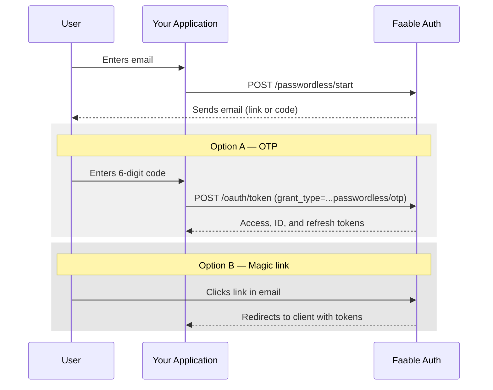

# Passwordless Authentication

Passwordless authentication lets a user sign in with just their email — no password to remember. Faable Auth sends either a **magic link** or a **6-digit one-time code (OTP)** to the address, verifies it, and issues tokens. If no user exists for that email yet, one is created on the first successful verification with `email_verified = true` (the click or the code proves ownership of the inbox).

The flow is driven by a connection of type `passwordless_email` configured on your tenant. See [Connections](connections.md) for setup.

## Flow overview



## Endpoints

| Method | Path                                    | Purpose                                                                                         |
| ------ | --------------------------------------- | ----------------------------------------------------------------------------------------------- |
| `POST` | `/passwordless/start`                   | Start the flow. Sends a link or a code to the email.                                            |
| `GET`  | `/passwordless/verify_redirect?token=…` | Public entry point for the magic link. Verifies, issues a session, and redirects to the client. |
| `POST` | `/oauth/token`                          | Exchange an OTP for tokens using the `passwordless/otp` grant.                                  |

The auth host follows the standard tenant URL (e.g. `https://your-tenant.auth.faable.link` or your [custom domain](custom-domain.md)).

### Throttle and TTLs

- **Send throttle:** `/passwordless/start` deduplicates sends per `(account, email)` for **3 minutes**. A second request inside that window returns success but does not re-send the email. The throttle is cleared automatically when the user completes verification.
- **OTP TTL:** **5 minutes** after issue.
- **Magic-link TTL:** **1 hour** after issue.

> [!IMPORTANT]
> On the **Hobby** plan, passwordless is limited to **100 emails (lifetime)**. **Pro** and **Business** include unlimited passwordless within your MAU allowance. See [Auth pricing](pricing.md).

## Implementation with `@faable/auth-js`

### Step 1 — Request the email

```ts
import { createClient } from '@faable/auth-js'

const auth = createClient({
  domain: 'your-tenant.auth.faable.link',
  clientId: '<your_client_id>'
})

// Magic link
await auth.signInWithPasswordless({
  email: 'user@example.com',
  type: 'link'
})

// OR — 6-digit code
await auth.signInWithPasswordless({
  email: 'user@example.com',
  type: 'code'
})
```

The redirect target after a magic-link click is the **Allowed Callback URL** configured on the client in the Faable dashboard — not a parameter on this call.

### Step 2a — Verify an OTP

```ts
const { data, error } = await auth.signInWithOtp({
  username: 'user@example.com',
  otp: '123456'
})
```

On success the SDK stores the session and emits `SIGNED_IN`. `data.user` and `data.session` are populated.

### Step 2b — Magic link

The link in the email points to `https://your-tenant.auth.faable.link/passwordless/verify_redirect?token=…`. Faable verifies the token, logs the user in, and redirects to the OAuth callback configured for the client. Your application picks up tokens from that redirect the same way it does for the [Authorization Code flow](oauth-flows/authorization-code.mdx).

## API reference

If you are not using the SDK, the same flow is reachable over HTTP.

### Start

```http
POST /passwordless/start
Content-Type: application/json

{
  "client_id": "cli_…",
  "email": "user@example.com",
  "send": "link",
  "connection_id": "con_…",
  "auth_params": { "state": "…", "redirect_uri": "https://app.example.com/cb" }
}
```

| Field           | Required    | Default  | Description                                                                                                                                              |
| --------------- | ----------- | -------- | -------------------------------------------------------------------------------------------------------------------------------------------------------- |
| `client_id`     | yes         | —        | The client driving the login.                                                                                                                            |
| `email`         | yes         | —        | Recipient address. Validated server-side.                                                                                                                |
| `send`          | no          | `"link"` | `link` for a magic link, `code` for a 6-digit OTP.                                                                                                       |
| `connection_id` | conditional | —        | Required when the account has more than one enabled `passwordless_email` connection. If omitted with a single passwordless connection, that one is used. |
| `auth_params`   | no          | —        | Extra parameters forwarded to the OAuth callback after verification (e.g. `state`, `redirect_uri`).                                                      |

Response:

```json
{
  "email": "user@example.com",
  "email_verified": false
}
```

The response shape is intentionally minimal — the email itself is the delivery channel.

### Verify a magic link

```http
GET /passwordless/verify_redirect?token=eyJhbGciOi…
```

Returns a `302` to the client's callback with the OAuth response (code or tokens, depending on the client configuration). The endpoint is idempotent on the user record but the underlying ticket is single-use.

### Verify an OTP

```http
POST /oauth/token
Content-Type: application/json

{
  "grant_type": "http://auth0.com/oauth/grant-type/passwordless/otp",
  "client_id": "cli_…",
  "username": "user@example.com",
  "otp": "123456",
  "scope": "openid profile email",
  "audience": "https://api.example.com"
}
```

Response on success:

```json
{
  "token_type": "Bearer",
  "access_token": "…",
  "id_token": "…",
  "refresh_token": "…",
  "expires_in": 3600
}
```

`scope` and `audience` are optional and behave the same as in any other OAuth 2.0 grant.

## User creation

On the **first** successful verification for an email, a user is created in the account with `email_verified = true`. On subsequent verifications for an existing user, `email_verified` is forced to `true` (the verification itself is fresh proof). No password is ever set on the user record by this flow.

## Errors

| HTTP  | When                                                                                                                                                                                                              |
| ----- | ----------------------------------------------------------------------------------------------------------------------------------------------------------------------------------------------------------------- |
| `400` | Invalid email, unknown `client_id`, `connection_id` not of type `passwordless_*`, connection disabled, no passwordless connection on the account, or multiple passwordless connections without a `connection_id`. |
| `400` | Magic link is malformed, expired, or has already been consumed.                                                                                                                                                   |
| `401` | OTP is wrong, expired, or already used.                                                                                                                                                                           |

Errors are recorded on the `auth_passwordless_total` metric (labelled `action=send|verify`, `status=success|error`) and on `auth_login_attempts_total` (`method=passwordless`).

## Notification emails

A single transactional template, `passwordless.start`, is sent for this flow. It renders one of two variants depending on `send`:

- **`passwordless.start.link`** — contains the magic-link button.
- **`passwordless.start.code`** — contains the 6-digit code, large and copy-friendly.

Both variants are localized (currently English and Spanish), use the tenant's logo and colors, and can be overridden per tenant from the dashboard.

## Next steps

- [Connections](connections.md) — create the `passwordless_email` connection driving this flow.
- [Authorization Code with PKCE](oauth-flows/authorization-code.mdx) — what happens after a magic-link click hits your callback.
- [Logs](logs.md) — audit every send and verification attempt.
