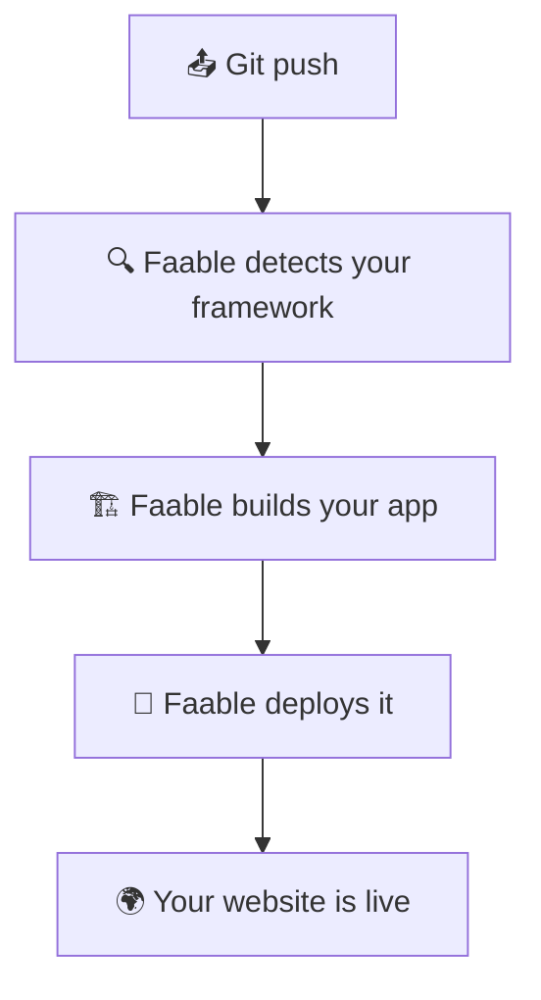

# How deployment works

**You push your code. Faable does the rest.** No pipelines to wire up, no
infrastructure to manage — from a Git push to a live website in minutes.

## What happens at each step

**📤 You push your code.** Commit to your release branch, like you always do.
That push is all it takes to ship.

**🔍 Faable detects your framework.** We look at your project and figure out how
it's built — Next.js, React, Vue, Astro, a Node or Python backend, and more.
Nothing to configure.

**🏗️ Faable builds your app.** We run your build for you and package everything
your app needs to run.

**🚀 Faable deploys it.** Your new version goes out with free automatic SSL and a
built-in Web Application Firewall — nothing to set up.

**🌍 Your website is live.** Your app is online at `https://<app>.faable.link`,
ready to share. Every future push ships the same way.

## Ready to deploy?

Link your repository and push your first app in minutes — see
[Get Started](get-started.md). Want to map your own domain?
See [Custom Domains](domains/custom-domain.md).
